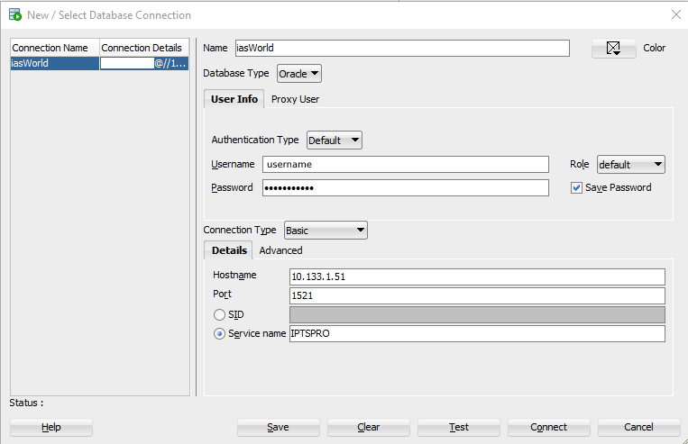

The CCAO is in the process of migrating its records from an IBM mainframe system to Tyler Technologies' iasWorld. iasWorld is a web-based property record and assessment management system backended by an Oracle database.

The Data Department has access to a mirror of the backend database. To get connected, please follow the steps below:

## 1. Download Oracle SQL Developer

Oracle has a free tool called SQL Developer which can be used to connect to, query, monitor, and manage Oracle databases. You can download SQL Developer [here](https://www.oracle.com/database/technologies/appdev/sqldeveloper-landing.html) (you'll need to create an account).

The executable runs self-contained, meaning it does not need to be installed. Just extract the `sqldeveloper/` folder from the downloaded `.zip` file, place it somewhere convenient, and launch the application contained in that folder.

## 2. Connect via SQL Developer

Once you've downloaded SQL Developer, you can connect to the mirror database ***as long as you are connected to the County VPN***. Once on the VPN, click **File > New > Connections** then fill out the dialogue as pictured below:



## 3. Connect via R

### RJDC

You can connect to the mirror database through R using the RJDBC package. To do so, complete the following steps:

1. Install the `RJDBC` package by running `install.packages("RJDBC")` in R.
2. Download and store a local copy of the [Oracle Database JDBC Driver](https://download.oracle.com/otn-pub/otn_software/jdbc/211/ojdbc8-full.tar.gz). You will need to provide the path to this driver when connecting through R.
3. You may also need to install the [Java SE Development Kit](https://www.oracle.com/java/technologies/javase/javase-jdk8-downloads.html) (try it without this first).
4. Create a environmental variable in your global `.Renviron` file with the following syntax: `DB_CONFIG_IASWORLD=jdbc:oracle:thin:<user_name>/<password>@<db_url>:<port>/<service>`, replacing variables where applicable. Ask @sweatyhandshake or @dfsnow for the correct `db_url`, port number, and service.
5. Create an additional environmental variable in your global `.Renviron` file with the location of the driver from step 2. The syntax should look something like: `DB_CONFIG_IASWORLD_DRV=C:/path/to/your/driver/ojdbc8.jar`.
6. Restart R and run the following code:

```r
# Load necessary packages
library(RJDBC)

# Set Rjava option to increase java mem size. Note that this is required for
# large queries!
options(java.parameters = "-Xmx8000m")

# Establish connection object, the drv parameter points to the locally stored
# Oracle JDBC driver from step 2. You can get it here:
# https://www.oracle.com/database/technologies/appdev/jdbc-ucp-21-1-c-downloads.html
IASWORLD <- dbConnect(
  drv = JDBC(
    driverClass = "oracle.jdbc.OracleDriver",
    classPath = Sys.getenv("DB_CONFIG_IASWORLD_DRV")
  ),
  url = Sys.getenv("DB_CONFIG_IASWORLD")
)

# Test the connection
dbGetQuery(IASWORLD, "SELECT * FROM IASWORLD.ASMT_HIST FETCH FIRST 100 ROWS ONLY")
```

### ODBC

You can also connect to the mirror database through R using ODBC. To do so, complete the following steps (everything should be 64-bit, not 32):

1. Install the `ODBC` and `DBI` packages in R.
2. Download and install [Oracle Instant Client](https://www.oracle.com/sa/database/technologies/instant-client/winx64-64-downloads.html). Both the "Basic Package" or "Basic Light Package" will suffice. Download the "ODBC Package" from the above URL as well.
3. Unzip instant client wherever you like, and add this directory to the PATH environment variable. To do this, navigate to `Edit the System Variales` in control panel, or type "PATH" in Windows search. Click `Environment Variables`, then edit `Path` in the bottom window. Click `New` and add the directory for your copy of Instant Client.
4. Download and install [Visual Studio Redistributable](https://support.microsoft.com/en-us/help/2977003/the-latest-supported-visual-c-downloads).
5. Unzip the ODBC package within the unzipped `instantclient_XX_XX` folder.
6. Execute `odbc_install.exe`.
7. Open `ODBC Data Source Administator` in windows and navigate to the `Drivers` tab to encure the `Orace in instantcline_XX_XX` ODBC driver installed.
8. Create a environmental variable in your global `.Renviron` file with the following syntax: `DB_CONFIG_IASWORLD_ODBC=DRIVER={Oracle in instantclient_19_10};DBQ=<db_url>:<port>/<service>;UID=<user_name>;PWD=<password>;`, replacing variables where applicable. Ask @sweatyhandshake or @dfsnow for the correct `db_url`, port number, and service.
7. Restart R and run the following code:

```r
# Load necessary packagess
library(DBI)
library(odbc)

# Establish connection object,
IASWORLD <- dbConnect(odbc(), .connection_string = Sys.getenv("DB_CONFIG_IASWORLD_ODBC"))

# Test the connection
dbGetQuery(IASWORLD, "SELECT * FROM IASWORLD.ASMT_HIST FETCH FIRST 100 ROWS ONLY")
```