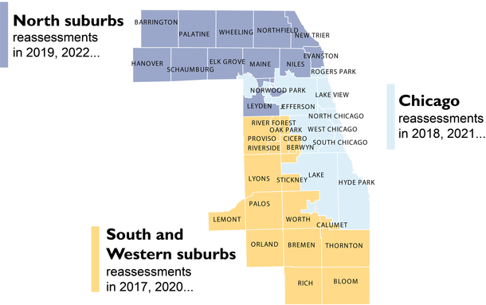

Cook County is divided into three parts, called "triads" or "tris". Triads are reassessed on a triennial assessment cycle (i.e. they are assessed every three years). Triads are made up of smaller units known as townships. Townships act as a sort of "unit of work" within the Assessor's Office, as they are assessed, mailed, appealed, and closed on a predetermined schedule.

Townships are also important for modeling, as they're often used as fixed effects (in conjunction with neighborhoods) to absorb geographic variation in assessed value. Below is an example map showing townships and their respective triads and reassessment years:



# Township Codes and Maps

The table below represents township and triad definitions as of 2024. A full map of townships and neighborhoods can be found [on the Open Data Portal](https://datacatalog.cookcountyil.gov/Property-Taxation/Assessor-Neighborhood-Map/8m2y-nirh).

|Township Name|Township Code|Triad Code|Triad Name|Township Map                                  |
|-------------|-------------|----------|----------|----------------------------------------------|
|Barrington   |10           |2         |North     | [2016](./townships/Barrington-2016.pdf)      |
|Berwyn       |11           |3         |South     | [2017](./townships/Berwyn-2017.pdf)          |
|Bloom        |12           |3         |South     | [2017](./townships/Bloom-2017.pdf)           |
|Bremen       |13           |3         |South     | [2017](./townships/Bremen-2017.pdf)          |
|Calumet      |14           |3         |South     |                                              |
|Cicero       |15           |3         |South     | [2017](./townships/Cicero-2017.pdf)          |
|Elk Grove    |16           |2         |North     | [2016](./townships/Elk-Grove-2016.pdf)       |
|Evanston     |17           |2         |North     | [2016](./townships/Evanston-2016.pdf)        |
|Hanover      |18           |2         |North     | [2016](./townships/Hanover-2016.pdf)         |
|Lemont       |19           |3         |South     | [2017](./townships/Lemont-2017.pdf)          |
|Leyden       |20           |2         |North     | [2016](./townships/Leyden-2016.pdf)          |
|Lyons        |21           |3         |South     | [2017](./townships/Lyons-2017.pdf)           |
|Maine        |22           |2         |North     | [2016](./townships/Maine-2016.pdf)           |
|New Trier    |23           |2         |North     | [2016](./townships/New-Trier-2016.pdf)       |
|Niles        |24           |2         |North     | [2016](./townships/Niles-2016.pdf)           |
|Northfield   |25           |2         |North     | [2016](./townships/Northfield-2016.pdf)      |
|Norwood Park |26           |2         |North     | [2016](./townships/Norwood-Park-2016.pdf)    |
|Oak Park     |27           |3         |South     | [2017](./townships/Oak-Park-2017.pdf)        |
|Orland       |28           |3         |South     | [2017](./townships/Orland-2017.pdf)          |
|Palatine     |29           |2         |North     | [2017](./townships/Palatine-2016.pdf)        |
|Palos        |30           |3         |South     | [2017](./townships/Palos-2017.pdf)           |
|Proviso      |31           |3         |South     | [2017](./townships/Proviso-2017.pdf)         |
|Rich         |32           |3         |South     |                                              |
|River Forest |33           |3         |South     | [2017](./townships/River-Forest-2017.pdf)    |
|Riverside    |34           |3         |South     | [2017](./townships/Riverside-2017.pdf)       |
|Schaumburg   |35           |2         |North     | [2016](./townships/Schaumburg-2016.pdf)      |
|Stickney     |36           |3         |South     |                                              |
|Thornton     |37           |3         |South     | [2017](./townships/Thornton-2017.pdf)        |
|Wheeling     |38           |2         |North     | [2016](./townships/Wheeling-2016.pdf)        |
|Worth        |39           |3         |South     |                                              |
|Hyde Park    |70           |1         |City      | [2018](./townships/Hyde-Park-2018.pdf)       |
|Jefferson    |71           |1         |City      | [2018](./townships/Jefferson-2018.pdf)       |
|Lake         |72           |1         |City      | [2018](./townships/Lake-2018.pdf)            |
|Lake View    |73           |1         |City      | [2018](./townships/Lakeview-2018.pdf)        |
|North Chicago|74           |1         |City      | [2018](./townships/North-Chicago-2018.pdf)   |
|Rogers Park  |75           |1         |City      | [2018](./townships/Rogers-Park-2018.pdf)     |
|South Chicago|76           |1         |City      | [2016](./townships/South-Chicago-2016.pdf)   |
|West Chicago |77           |1         |City      | [2016](./townships/West-Chicago-2016.pdf)    |

### Accessing township definitions via R

Township and triad codes are also accessible via the [CCAO R package](https://github.com/ccao-data/ccao). You can retrieve this data with the following code:

```r
# After installing the package using the instruction in the package README, load the ccao library
library(ccao)

ccao::town_dict
```
