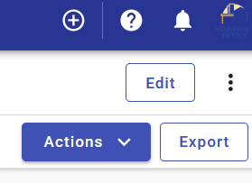
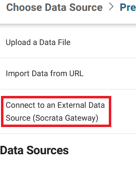
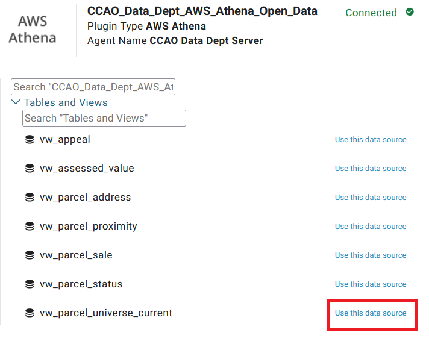

## Refresh an open data asset

We keep many of our assets updated on a monthly basis using Socrata's API. Because of how long the API calls take we avoid updating assets that don't change between annual updates, and only keep the most recent year of data up-to-date for the others. This means years prior to the most recent on the open data portal will drift out of sync with their sources over the course of a year. We address this with a complete refresh of all the appropriate assets once a year, typically in February. Since the API is relatively slow and can time out, we use Socrata's [Data & Insights Gateway](https://support.socrata.com/hc/en-us/articles/360033395434-Gateway-Overview) agent to trigger full refreshes.

### How to refresh an asset

You need to be logged into the open data portal as the Assessor Data user in order to make edits to open data. If you need login credentials, reach out to a senior staff member.

On the open data portal, choose the asset you'd like to update. For this example we'll work with [Assessor - Parcel Universe (Current Year Only)](https://datacatalog.cookcountyil.gov/Property-Taxation/Assessor-Parcel-Universe-Current-Year-Only-/pabr-t5kh/about_data).

1. In the top right, click the "Edit" button.

2. Click "Add Data" and select "Replace". Do NOT select "Upsert" - this will not delete rows that have been removed from the asset's source.

3. From the "Choose Data Source" menu select "Connect to an External Data Source (Socrata Gateway)"

4. Expand the "CCAO Data Dept Server" agent, and choose the plugin that ends with "_Open_Data". This part of the name can be hidden, but it's usually the third from the left. You can open each one to check, if necessary.

5. Expand "Tables and Views" and select the appropriate data source. In our case, "vw_parcel_universe_current".

6. A notification will pop up in the top right notifying you the data is being fetched.

7. After a while, the open data portal will open a data preview window. The open data portal will need to ingest all of the data for the asset and check it before it will allow the asset to be updated. For now you can click "Done" in the bottom right and wait for the asset to finish ingesting. Once it's done the "Update" button on the asset's main page will turn blue and can be clicked. The open data portal will notify you that it's updating the asset and let you request an email confirmation once the asset has successfully or unsuccessfully finished updating.
