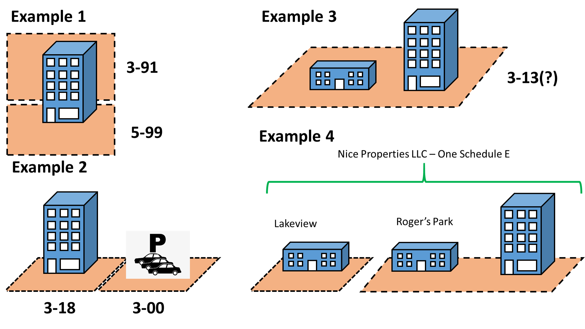

# What is the Real Property Income and Expense Online Form?

The RPIE Online Form isn't a "form"; RPIE is a crowd-sourced database of commercial real estate. RPIE serves two primary purposes. First, RPIE is designed to build and maintain a complete inventory of commercial real estate assets in Cook County. Commercial real estate assets include land and structures that may be bought and sold in real estate markets. The CCAO cannot produce a reliable assessment roll of commercial properties without knowing what the properties' physical characteristics are. 

Second, RPIE is designed to collect a sufficient amount of financial and economic data to be able to estimate the value of these assets with a reasonable level of precision and accuracy. RPIE is designed to collect data in such a structured way as to be useful in automated valuation models. Primarily, this data includes income and expense data, and lease data. 

The universe of 'commercial real estate assets' is extreamly diverse. This means that the universe of physical structures, and the attributes pertinent to their valuation, is diverse. Historically, property appraisal is a labor-intensive task requiring substantial experties and knowledge of local market conditions. This is so because the methods of property appraisal were opaque, and the information required to appraise property was difficult to access. In both the public and private sectors, however, there is a strong trend towards a standardized, data-driven approach to property appraisal (see, for example, the [Uniform Residential Appraisal Form](https://sf.freddiemac.com/general/uad-faq#new-uad-and-forms-redesign)) There are many good reasons behind this push to standardize and digitize real estate appraisal data. With the RPIE, the CCAO hopes to collect highly ordered and standardized data to help it appraise commercial property in Cook County.

The CCAO faces a particularly difficult challenge compared to private sector appraisers. The CCAO is tasked with estimating the value of *every single commercial property* in the County every three years. Private sector appraisers often create individual appraisals upon request, often to support a real estate transaction. The CCAO is almost unique both in terms of the number of estimates it must produce, as well as the information scarcity it faces. In order to meet these challenges, the CCAO needed an innovative data platform to gather and organise information.

# The RPIE development process

The RPIE was designed by CCAO staff and built by [Clarity Partners LLC](https://www.claritypartners.com/). It is unique in both the public and private sectors. We know of no similar platform in either the public or private sector. This is not surprising given 

development of the RPIE platform proceeded incrementally. In the sections below, I outline the primary goals of each RPIE version, and how we acheived those goals. 

## RPIE Version 1

The universe of commercial property is extremely diverse. It would not have been feasible to develope, from scratch, a comprehensive data collection apparatus to support the CCAO in one year that successfully collected data on all commercial properties. Instead, we started with the most common, and easiest use cases in the County. For the first iteration, we attempted to build a system to collect data on properties that generate rental income that is reported on either a, IRS Schedule E or 8825. These include apartment buildings and office spaces.

In addition to the RPIE Online Form, the office used a fillable PDF form as a backstop for properties that were not supported by V1. 

V1 went live at the end of 2019.

### Defining the data model

The primary task of RPIE V1 was to define a [data model](https://en.wikipedia.org/wiki/Data_model) that would be flexible enough to evolve over time, but also specific enough to impose structure onto the data. The RPIE data model identifies and relates the objects described below.

#### Economic unit

At the least granular level, income and expense information is reported by an economic unit. For the purposes of RPIE, an economic unit may be a single person or a company with one or more real estate assets.  In RPIE, there is a 1:1 corrospondence between a single RPIE filing and an economic unit.

#### Building

RPIE V1 defined a 'building' as a structure that contained rentable spaces. This included apartment, office, and retail buildings, but excluded a large number of other building types.

There is a m:m relationship between buildings and economic units. In some cases, one economic unit will own multiple buildings. In others, a building will contain many economic units. For example, a large office tower with multiple lessees responsible for taxes. 

#### Spaces (leased and vacant)

RPIE V1 defined a space as a sub-division of a building that may be rented. There are two types of spaces: 'residential' and 'commercial.' Each type of space has its own vector of attributes, including lease status. A user that properly populates the spaces template will include both leased and un-leased spaces. 

There is m:1 relationship between spaces and buildings. The spaces data allow us to programatically calculate a building's gross potential income and vacancy rate, and attach those calculations to buildings.

#### Property Index Number (PIN)

Though often depicted as a cadasteral division, the PIN is actually an accounting identity. PINs identify, spatially in most cases, the tax liability for real estate assets. There is a m:m relationship between PINs and buildings, and PINs and economic units. I would not be surprised to see multiple PINs associated with a single space, though it would be uncommon. 

The image below shows four different examples of how the objects defined above may associate in real life. RPIE V1 is designed to identify and accomodate these different relationships in a structured data model.

Example 1 shows a single building with two PINs, where one PIN is associated with all the residential spaces, and the other PIN is associated with all of the commercial spaces. Example 2 shows a PIN associated with a single building that contains both commercial and residential spaces. Example 3 shows a single PIN associated with multiple dissimilar buildings. And Example 4 shows an economic unit associated with different PINs and buildings some distance from one another. RPIE's data model accomodates all of these cases.

#### Parties

Parties are simply the people creating and submitting filings. There is a m:m relationship between parties and filings. Attornies may be associated with many filings, while owners of single properties are only associated with one filing anually.

### Defining the user-experience

We wanted the RPIE Online Form to resemble digital tax prep software like TurboTax. In order to accomplish that, we needed a clear data model, and a clear understanding of the order in which users needed to input information. For example, it was clear that users would have to input buildings before spaces, since spaces are contained inside of buildings. The chart below shows our initial outline. 

#### Securing RPIE via RPIE codes

What would stop a malicious actor from filing thousands of erroneous RPIE filings? PINs and addresses are public information, posted online. It would be a simple task to create a program that files millions of erroneous RPIE filings with bogus data. If that were to happen, the entire RPIE database would be rendered nearly worthless, since it would be impossible to distinguish legitimate filings from erroneous ones. 

To secure RPIE, we generated random codes that we mailed to taxpayers directly. Users can only create accounts and filings by entering the correct RPIE <> Code combination. While this does not entirely eliminate the possibility of an erroneous filing, it eliminates the type of programatic attack that RPIE is most exposed to.

### Documentation and privacy

Transparency is a core value in the data science department. It was extreamly important that we clearly define the data we would be collecting, and how that data would be used. 

## RPIE Version 2

The primary development goal for RPIE V2 was to accomodate a wider diversity of property types. Many commercial properties do not file IRS Schedule E or 8825 forms, even many that do collect traditional rental income. For example, properties that have recently underwent a change of ownership will not have these forms available. Properties held by much larger companies will typicall submit income and expense reports to their corporate owners. Most hotels and motels do not treat their income as typical rental income. Owner-occupied properties do not collect rental income. 

The main challenge to this goal was that we have no way of identifying the type of property associated with a user of the system. The CCAO's data on commercial property is so sparse that we cannot identify which properties are owner-occupied, which contain multiple buildings, etc. The RPIE system has to identify the user's specific property type and financial structure, and then display screens requesting the specific and appropriate information. 

### Questionnaire 

For RPIE V2, we designed a simple set of questions that would dictate which data screens a user would see. I have put the initial diagram, an intermedia diagram, and the final diagram to show the evolution of these questions. The primary challenge was to choose the right language for each question and the right order of the questions such that users were successfull categorized into their respective RPIE groups.

## RPIE V3

The CCAO will continue to develop the RPIE platform.

