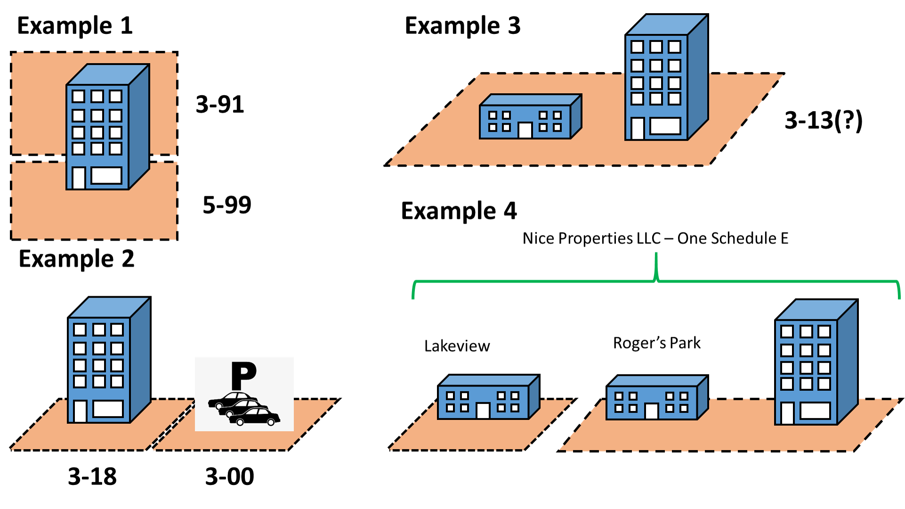
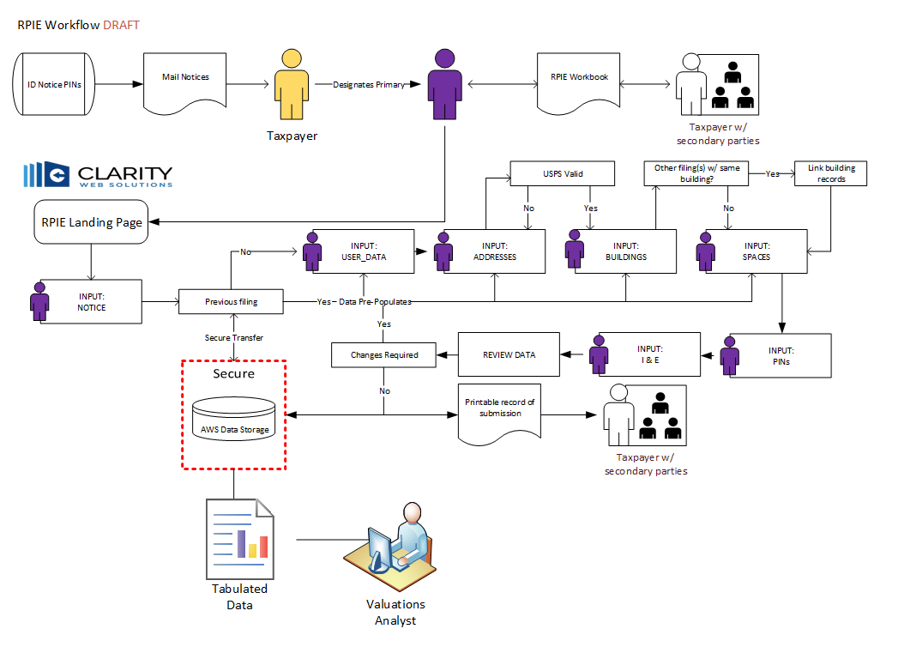
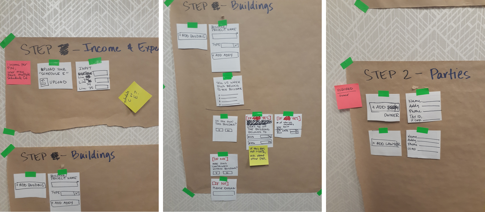
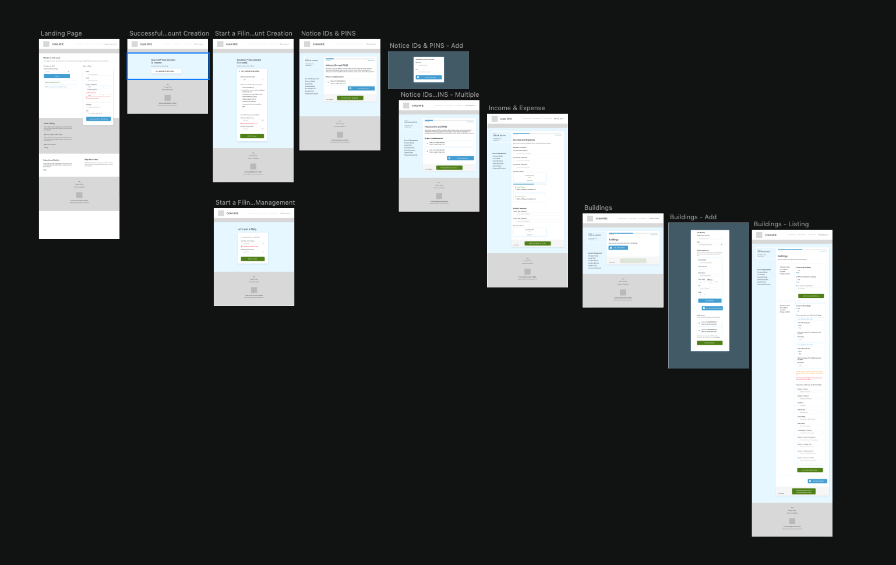
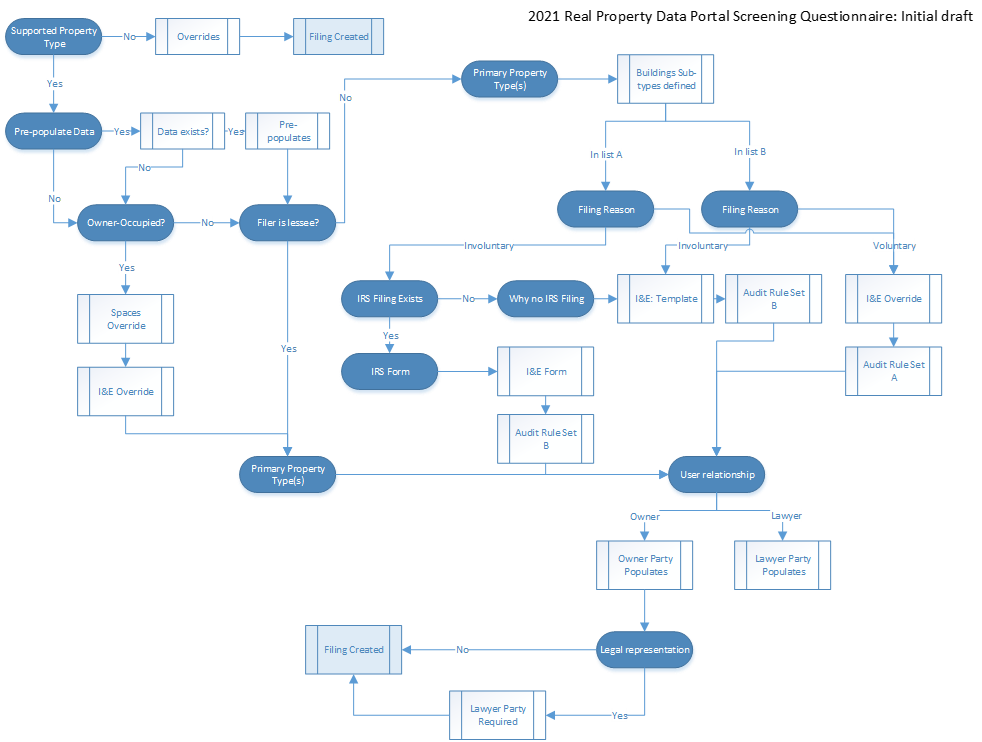
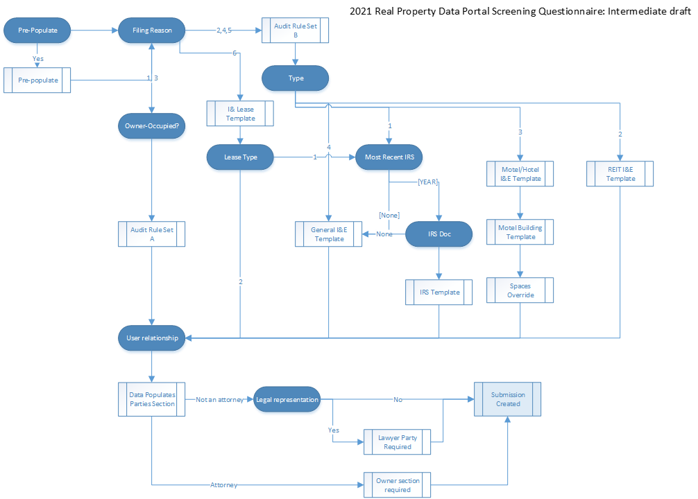
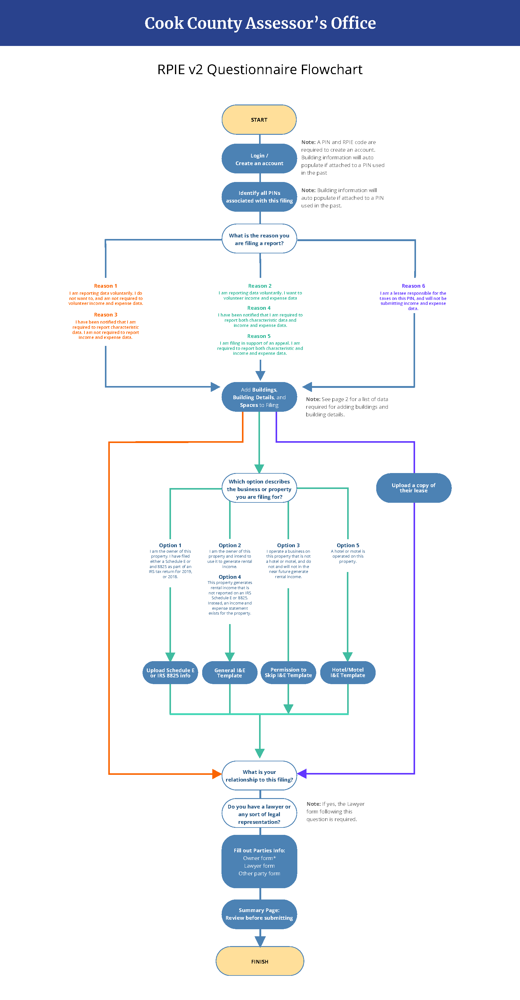
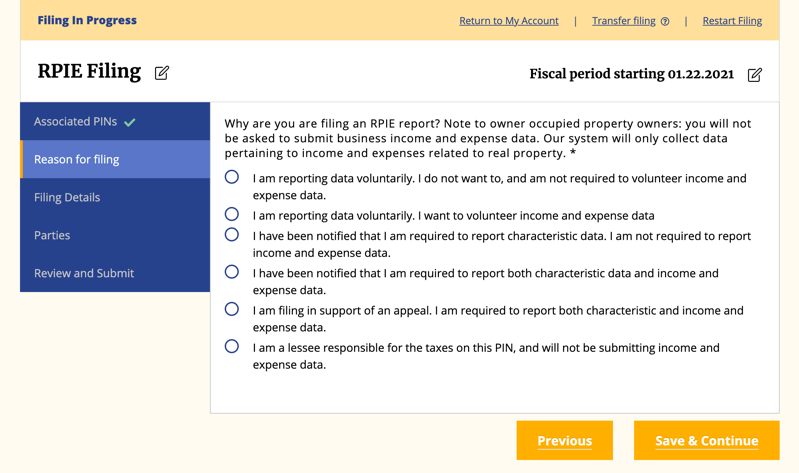

# What is the Real Property Income and Expense Online Form?

Commercial real estate is diverse, and the attributes of each property are unique. When estimating the value of commercial real estate assets, experts need to be aware of those attributes. Historically, these details have been difficult to find or access, making property appraisal an opaque and labor-intensive task. In both the public and private sectors, there is a trend towards a standardized, data-driven approach to property appraisal (see, for example, the [Uniform Residential Appraisal Form](https://sf.freddiemac.com/general/uad-faq#new-uad-and-forms-redesign)). At minimum, standardization will increase transparency and improve efficiency.

Increased transparency and improved efficiency in property appraisals are vital to the success of the Cook County Assessor’s Office. Every three years, the CCAO estimates the value of every commercial property in the County. This is a unique challenge compared to private sector appraisers.The CCAO is almost unique both in terms of the number of estimates it must produce, as well as the information scarcity it faces. In order to meet these challenges, the CCAO needed an innovative data platform to gather and organize information. The Real Property Income and Expense Online Form (RPIE, pronounced 'R pie', like the dessert) is designed to collect and maintain the data required to accurately and fairly assess commercial property.

RPIE serves two primary purposes. First, RPIE is designed to build and maintain a complete inventory of commercial real estate assets in Cook County. In order to accurately estimate the value of *every single* commercial property in the County, the CCAO needs a highly detailed inventory of all of that real estate. That inventory needs to be stored in a structured data base so that it can be easily accessed and leveraged to estimate real estate values.

Second, RPIE is designed to collect a sufficient amount of financial and economic data to be able to estimate the value of commercial real estate assets with a reasonable level of precision and accuracy. RPIE is designed to collect data in such a structured way as to be useful in automated valuation models. Primarily, this data includes income and expense data, and lease data.

Fundamentally, the RPIE Online Form is not a form at all; it is a crowd-sourced database of commercial real estate data. It is our hope that the RPIE Online Form evolves to become a common source of truth in commercial property assessment, bringing the public and the CCAO together around a common set of facts.
# Current uses of RPIE data

Our valuations team uses RPIE data in multiple ways to support the accurate revaluation of commercial properties, including:

* Conducting market research on average rents, incomes, and vacancies in neighborhoods.

* Verifying property-specific information, such as whether it was recently in a ramp-up period.

# Agile, not half-baked: The evolution of RPIE

The RPIE was designed by CCAO staff and built by [Clarity Partners LLC](https://www.claritypartners.com/). An iterative approach to design and development has produced a completely unique platform. RPIE is the only one of its kind—in both the private and public sectors.

## RPIE Version 1

Two major constraints guided the first phase of development:

* Data needed to be collected in a structured and systematic way from a highly diverse user group.
* The development timeline was 10 months.

A comprehensive data collection tool for all commercial properties could not be built in a single year. The CCAO adopted an agile approach to development, prioritizing the features necessary to collect data on the most common properties. The most common properties to generate rental income—apartment buildings and office spaces—report a Schedule E or 8825 to the IRS. Properties with these tax forms became the focus of the RPIE V1 online form. In an effort to collect details about properties that did not meet the requirements of the V1 form, the office used a fillable PDF as a backstop.

V1 development began in the spring of 2019 and was deployed at the end of 2019.

### Mise en place: The RPIE data model

The primary task of RPIE V1 was to define a [data model](https://en.wikipedia.org/wiki/Data_model) that would be flexible enough to evolve over time, but also specific enough to impose structure onto the data. The RPIE data model identifies and relates the objects described below.

* **Economic unit:** At the least granular level, income and expense information is reported by an economic unit. For the purposes of RPIE, an economic unit may be a single person or a company with one or more real estate assets.  In RPIE, there is a 1:1 corrospondence between a single RPIE filing and an economic unit.
* **Income and expense data:** Income and expense data attaches to the economic unit, and sometimes buildings, depending on how the econonomic unit tracks its financial data. For example, the first page of the [IRS Schedule E](https://www.irs.gov/pub/irs-pdf/f1040se.pdf) allows a filer to include three different properties separatly as A, B, and C, though this is not required.
* **Building:** *RPIE V1* defined a 'building' as a structure that contained rentable spaces. This included apartment, office, and retail buildings, but excluded a large number of other building types.
     * There is a m:m relationship between buildings and economic units. In some cases, one economic unit will own multiple buildings. In others, a building will contain many economic units. For example, a large office tower with multiple lessees responsible for taxes.
* **Spaces (leased and vacant):** RPIE V1 defined a space as a sub-division of a building that may be rented. There are two types of spaces: 'residential' and 'commercial.' Each type of space has its own vector of attributes, including lease status. A user that properly populates the spaces template will include both leased and un-leased spaces.
     * There is m:1 relationship between spaces and buildings. The spaces data allow us to programatically calculate a building's gross potential income and vacancy rate, and attach those calculations to buildings.
     * [Residential spaces template](templates/2021-rpie-residential-spaces-template.xlsx) can be found here.
     * [Commercial spaces template](templates/2021-rpie-commercial-spaces-template.xlsx) can be found here.
* **Property Index Number (PIN):** Though often depicted as a cadasteral division, the PIN is actually an accounting identity. PINs identify, spatially in most cases, the tax liability for real estate assets.
     * There is a m:m relationship between PINs and buildings, and PINs and economic units. I would not be surprised to see multiple PINs associated with a single space, though it would be uncommon.
* **Parties:** Parties are simply the people creating and submitting filings.
     * There is a m:m relationship between parties and filings. Attornies may be associated with many filings, while owners of single properties are only associated with one filing anually.

### Combining ingredients: Practical examples of the data model

The image below shows four examples of different combinations of property and PINs.

#### Example 1

A single building with two PINs, where one PIN is associated with all the residential spaces, and the other PIN is associated with all of the commercial spaces. In this instance, PIN are associated with the single building in one filing, and the spaces within the building are associated with PINs based on the PIN's class code.

#### Example 2

A PIN associated with a single building that contains both commercial and residential spaces, with a second PIN associated with the paved lot for the building. These PINs are associated via a single filing ID.

#### Example 3

Multiple buildings on a single PIN, where the buildings are substantially different. In this case, one PIN and one filing would be associated with two building IDs. Each building is associated with its own spaces and attributed, allowing the system to value each independently.

#### Example 4

Multiple buildings on multiple PINs that are not adjacent to one another. In this case, the single filing is associated with the owner of all of these properties, associating the PINs and buildings with a common owner.

### Plate it up: How we designed the user experience

The term “user experience” is generally used in the context of digital interfaces. User experience has a broader definition, which encapsulates every experience a person has with a brand or organization. With RPIE, Cook County constituents have both digital and physical experiences. Humans interact and respond to data differently than machines. While the structure of RPIE data is designed to support automation valuation models, the source of the data is human.

To create a form usable to humans, we needed a thorough understanding of the questions we would ask our users. The image below shows a preliminary diagram of the steps a user would go through during their filing.

In order to make these steps clear and understandable, we then needed to put ourselves in our users’ shoes. Using paper, scissors, and tape, we walked through the workflow. We asked ourselves questions like:

* As a user, what information do I need to get a sense of this process?
* As a user, what is the minimal amount of information I need to share to proceed in the process?
* As a user, does Question A make logical sense after Question B?
* As a user, why do I care about this question?
* As a user, do I understand what’s being asked of me?

We then translated our work into a preliminary set of wireframes, which were used to build the first test site version. CCAO visual brand guides were applied to the wireframes prior to launch.

#### Securing RPIE via RPIE codes

If cinema has taught us anything, it's that all Apple pies cooling in windows are targets of petty theft. What would stop a malicious actor from filing thousands of erroneous RPIE filings? PINs and addresses are public information, posted online. It would be a simple task to create a program that files millions of erroneous RPIE filings with bogus data. That would create a real headache for our data science team.

To secure RPIE, we generated random codes and mailed them to taxpayers directly. Users can only create accounts and filings by entering the correct RPIE <> Code combination. While this does not entirely eliminate the possibility of an erroneous filing, it eliminates the type of programmatic attack that RPIE is most exposed to.

### Documentation and privacy

The CCAO's Data and Legal teams developed a privacy policy, available [here](https://rpie.cookcountyassessor.com/privacy-policy).

## From proof to bake: RPIE Version 2 expansion

While most common type of commercial properties in Cook County are those with rental income, there are many other types. The primary goal for RPIE V2 was to create online forms for a wider diversity of property types. Examples include:

* properties with a recent change in ownership
* properties held by larger companies
* hotels and motels
* owner-occupied properties

V2 went live in November of 2020, and the CCAO discontinued the fillable PDF that was used as a backstop in 2019.

### Updates to the data model

We added different types of income and expense data:

* Model/Hotel I&E
* General I&E

Templates for these forms can be found [here](templates/rpie-ie-templates.xlsx).

### User experience

For RPIE V2, the user experience needed to be different based on the user's 'type'. For example, users voluntarily filing an RPIE statement may not be required to submit income and expense information, but users filing an RPIE in support of an appeal would be required to submit income and expense information. Unfortunately, the CCAO cannot identify a user's type automatically based on PIN. Since an RPIE filing is required prior to submitting an appeal, the CCAO cannot determine which users are submitting voluntarily, and which in support of an appeal. Another example is owner-occupied properties; users filing on owner-occupied properties are not required to submit income and expense information, but the CCAO does not reliably know which PINs are and are not owner-occupied.

RPIE V2 needed a mechanism to identify user's types and sort them into the appropriate set of screens. The goals for RPIE V2 included:

* Additional forms to accommodate a larger diversity of property owners, including
     * Those with income and expense data repored on Income and Expense statements
     * Those without real property income and expense data, including
          * Lessees responsible for taxes
* Increased flexibility for adding income and expense data at various levels of aggregation
* Increased diversity of 'buildings,' including parking garage.
* Allow explicit designation of vacant lots.
* Allow users to add their own business types to the filing.
* Change the form interface from an open format (ability to access any part of the form at any time) to a linear format (step-by-step from start to finish process).

### Potato, Potahto: How to accomodate different users' business vernacular

From the perspective of real estate valuation, the type of business operated on a property may be important information in order to estimate the value of the property. However, the categorization schema used by real estate professionals may differ considerably from the user's understanding of the business type. For example, the CCAO had a conversation with a number of owners of event spaces in Chicago. During that conversation, the CCAO learned that the term 'night club' carriers an undesirable connotation among some event space owners.

In order to accommodate users' expectations about their own businesses, we added a feature that allows users to add business types to the list of possible types for all users. The disadvantage of this is that the CCAO will have to parse and clean this list occasionally. The advantage is that it allows users to describe their businesses as they understand them, without needing a knowledge of real estate categorization.

### Questionnaire to Qualify User Taskflow

Our users are not experts in property appraisals or tax law, and nor should they be to submit their RPIE form. Since the CCAO cannot automatically assign a form to a user, we created a series of questions to help get the user to and through the appropriate form. The RPIE V2 questionnaire went through many iterations. With each iteration, the CCAO and Clarity Partners sought to minimize the number of questions a user would have to answer in order to be correctly categorized by the RPIE system. This included:

* Wording questions in a clear and concise manner.
* Asking questions in the right order to eliminate redundancy.
* Asking questions at the appropriate point in a filing.

#### Questionnaire iteration 1

The image below shows the first version of the questionnaire structure. In the design below, blue ovals indicate questions and boxes represent forms. Iteration 1 had too many poorly worded questions asked in a suboptimal order.

#### Questionnaire iteration 2

Clarity Partners UX researchers evaluated iteration 1 and worked with CCAO subject-matter experts to identify a few keys pieces for design improvement. User feedback collected during RPIE V1 was shared with the UX designers, who leveraged both pieces of research in RPIE V2. The result of this work was the design depicted below. In this iteration, questions have been condensed and re-ordered.

#### Questionnaire iteration 3

Further refinement of the questionnaire by Clarity Partners UX designers resulted in the final questionnaire structure, depicted below.

#### Questionnaire in RPIE

The end-result of this work is a 'wizard-like' approach to the user experience that guides users through their filing. In the image below, the text color corrsponds to the color of the arrows indicating the path through the RPIE system.

## Development costs

| Item                                                               | Amount                |
|--------------------------------------------------------------------|-----------------------|
| **RPIE Application (v1)**                                             | **$      353,099.75**     |
| Application Maintenance and Support Professional Services          | $           9,931.25  |
| **Contingency / Unknowns (RPIE v2)**                                   | **$      163,323.05**     |
| On Demand Services                                                 | $         11,790.00   |
| AWS Contingency / Unknowns                                         | $           9,528.20  |
| AWS Fixed Setup Cost - RPIE Application Infrastructure [Fixed Fee] | $         37,125.00   |
| AWS Hosting Usage / Utility                                        | $         18,143.18   |
| Managed Hosting Services                                           | $           1,304.44  |
| **Grand Total**                                                        |**$      604,244.87**|

## RPIE V3

### Feature considerations for V3

#### Expand 'buildings' section to include a wide range of real assets
RPIE V2 has a narrow conception of a 'building,' essentially a structure that generates income by being rented, or being able to be rented. The buildings section of RPIE should be expanded in scope to include all 'real assets.' This would including parking garages, vacant lots, out-buildings, production facilities, cellular towers, chemical storage, etc. This can be achieved with minimal alteration of the underlying data model.

#### Expand building characteristics to include more features specific to building types
The CCAO will want to collect different physical attributes of structures based on the structure type. RPIE V2 collects the same attributes of all buildings. In the future, physical attributes should be contingent on structure type.

#### API input
The CCAO should develop APIs and documentation to allow third party data managers to push RPIE filings into the system. This would greatly reduce the time-cost of creating RPIE filings.

### UX Considerations for V3
Below is a list of general principles for interaction design developed by designer Jakob Nielsen. These have become common place principles for any positive user experience. Below each principle is an explanation on how it applies to RPIE V2 and recommendations for future states.

See [Jakob Nielsen’s 10 heuristics](https://www.nngroup.com/articles/ten-usability-heuristics/) for more information on these UX best practices.

#### Visibility of System Status
The design should always keep users informed about what is going on, through appropriate feedback within a reasonable amount of time.

How it applies to RPIE V2:
* A large part of the form is currently located under “Filing Details” and leaves the user uninformed about what’s next.
* Consider splitting “Filing Details” into multiple items. These items would need to be dynamic and relevant to the user, based on the taskflow identified through the questionnaire.

#### Match Between System and the Real World
The design should speak the users' language. Use words, phrases, and concepts familiar to the user, rather than internal jargon. Follow real-world conventions, making information appear in a natural and logical order.

How it applies to RPIE V2:
* The language of the online form is geared towards property lawyers.
* Consider simplifying the language, with shorter sentences. An 8th grade reading level is recommended for UI language intended for a broad audience.

#### User Control and Freedom
Users often perform actions by mistake. They need a clearly marked "emergency exit" to leave the unwanted action without having to go through an extended process.

How it applies to RPIE v2:
* Currently, RPIE users have to restart their form to make changes.
* Consider giving the user more control to go between sections by evolving the side bar into navigation. This would give users insight into the requirements of the form and the freedom to choose to engage.

#### Flexibility and Efficiency of Use
Shortcuts — hidden from novice users — may speed up the interaction for the expert user such that the design can cater to both inexperienced and experienced users. Allow users to tailor frequent actions.

How this applies to RPIE V2:
* In the case of CCAO, it is necessary to address human emotion as part of user experience because the organization faces intense public scrutiny. End users are fearful of the organization. To build trust, we must remind users their emotions are valid and give them space to make decisions.
* RPIE’s end users complete the online forms. The online forms are designed to support the data structure, which is designed to support automation valuation models.
* Consider reformatting the online form to support end user (human) completion. While a machine is capable of processing large amounts of data, the human capacity to manage the same amount of information is limited. RPIE’s online forms should be designed to collect the minimum amount of information in an effort to support human capacity and emotion. For users with a higher capacity and confidence, the option to provide additional details should exist within the interface.

#### Help and documentation
It’s best if the system doesn’t need any additional explanation. However, it may be necessary to provide documentation to help users understand how to complete their tasks.

How this applies to RPIE V2:
* Many users are reluctant to file an RPIE. This could be an indication that users do not understand why RPIE is beneficial to them.
* Consider adding help/information documents to each section. These documents should clearly state why this information is needed and how it will be used.

