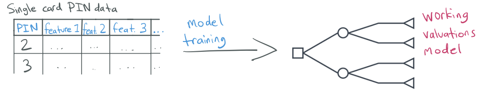
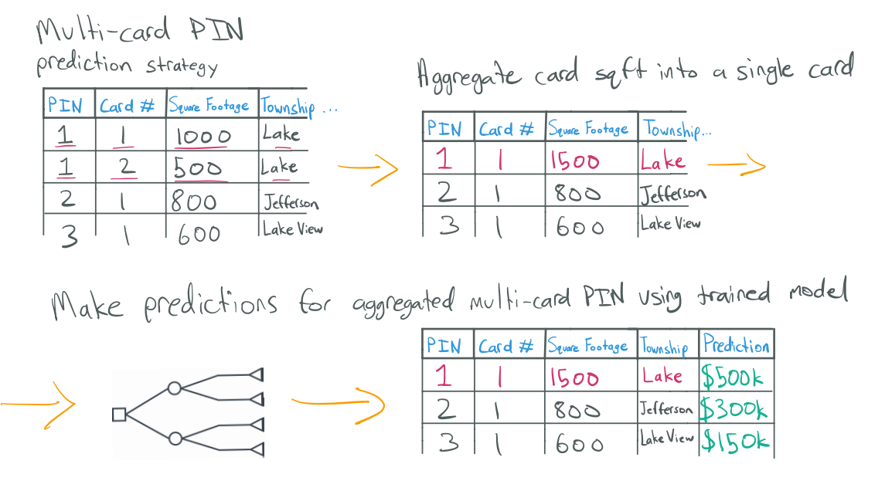

# Valuing Multi-Card PINs

## Introduction

Multi-card parcels are properties (PINs) containing more than one building, each represented individually
as a separate "card."

Our model is trained at the building level, using specific features, characteristics, and
location data for each individual structure. This makes it difficult to accurately value
parcels that contain multiple buildings, since the model is designed to assess one building
at a time. Multi-card PINs are also excluded from the training data, so the model doesn't
see examples of them during training.

We have two different methods for valuing these parcels, depending on the number of cards
involved. For parcels with 2 or 3 cards, we use a method that aggregates the total building square footage
from all cards into a single "main" card and performs a single prediction. Then, to generate a card-level
value, we multiply the PIN-level value by the proportion of square footage that each card contributes to
the total building area. For parcels with 4 or more cards, we sum individual card-level predictions to get
the parcel-level prediction. This document explains the framework behind these methods and the rationale for
our approach.

### Why We Exclude Multi-Card PINs from Training

Machine learning models work better when they are trained on data with
a consistent structure. Ensuring every single row in the training data is a single-card
sale helps the model learn the relationship between features and values more effectively.
It doesn't have to account for variation between single-card and multi-card PINs. We've
confirmed this through testing, including multi-card PINs in the training data results
in a significant drop in performance for single-card PINs, which make up the overwhelming
majority of residential PINs in cook county.

## 2-3 cards: Aggregated Building Area on a Single Card (2-3 card PINs)

To improve these values, we consolidate the total building square footage from all cards into a single "main"
card and perform a single prediction. This approach allows us to reflect the total building area while keeping
the model’s input structure consistent. Internal testing shows that this method consistently produces more
accurate and reliable values for multi-card PINs compared to the the summing approach.

## Valuing 4+ Card PINs

For PINs with 4 or more cards, we value multi-card PINs by individually predicting the value of each
card and summing these predictions. These cases are rare and often unusually complex, sometimes
resulting from administrative anomalies in the underlying data. For example, a recorded sale might
include several cards when, in reality, one of those buildings has been split off into a new PIN that
isn’t captured in our data. Because of these inconsistencies—and the lack of a reliable theoretical
foundation for aggregation in such cases—these PINs are usually flagged for additional manual review.
We don't yet have the confidence or clarity in the data structure to apply the same aggregation method
used for 2–3 card PINs.

### Breaking Ties in Building Square Footage

When selecting which card should act as the "main" for aggregation, we apply the following logic:

1. Choose the card with the **largest building square footage**.
2. If there's a **tie**, we select the card with the **lowest card number** (e.g., Card 1 before Card 2).

**Example:**  
_If two buildings are both 1,200 sqft and one is Card 1 and the other is Card 2, we designate Card 1 as the main._
