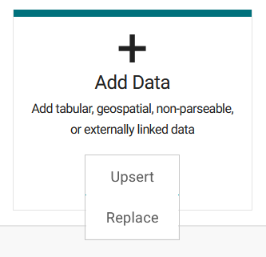
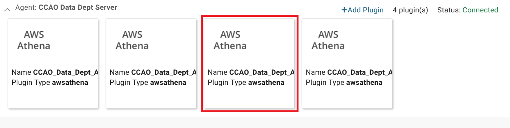
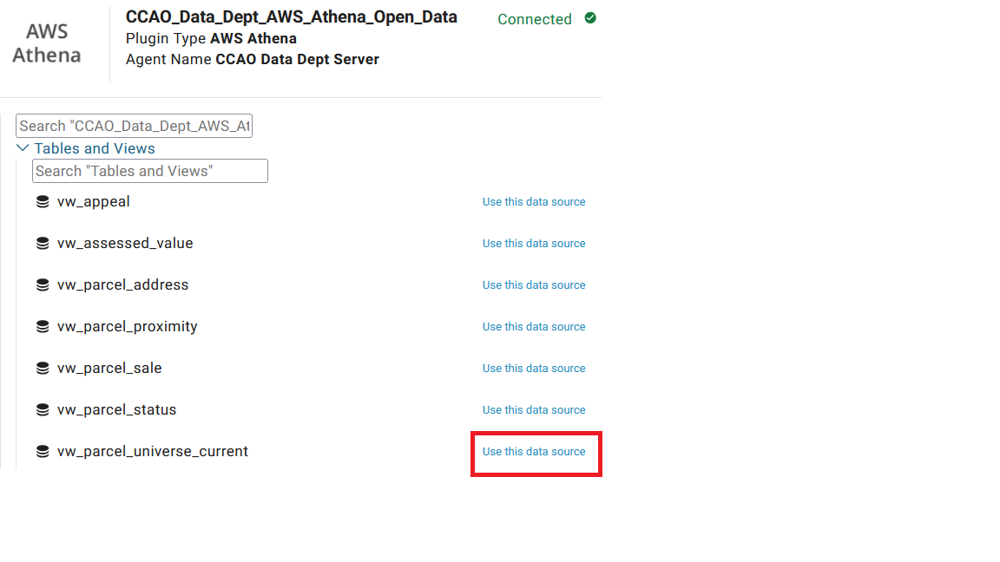
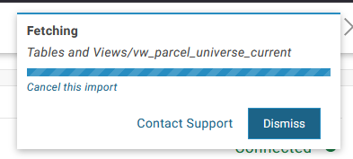

The Cook County Assessor's Office is committed to transparency. To fulfill that commitment, the Data Department creates and maintains public assessment-related data sets. This document outlines these data, their uses, and pertinent source code. Data is published primarily on the [Cook County Open Data Portal](https://datacatalog.cookcountyil.gov/browse?tags=cook+county+assessor) and through GitHub. The [AssessR](https://ccao-data.github.io/assessr/articles/example-ratio-study.html) package leverages this open data in its documentation.

## Releasing Open Data

Releasing open data entails building reproducible data, documenting it, determining how and how often it should be updated, and receiving clearance from all necessary parties. These steps are outlined in further detail below.

### Building Data

Open data should, whenever possible, be automatically updated (views or tables in Athena), well-maintained, or immutable (political boundaries). Datasets that are released to the public ***must be scripted and the script must be version-controlled***. To avoid creating discrepancies between internal and public use of the Department's data, data should not be built in a manner that is inconsistent with how it is used within the Department. Keep data as simple as possible - don't add columns that won't be useful for end-users and don't release redundant data.

### Adding Data to the Portal

The Data Department releases open data through the Cook County Open Data Portal, a service maintained by Socrata. For data that lives in the Department's warehouse, the preferred method for upload is through a provisioned Athena or S3 Socrata Gateway. When creating a new dataset there will be an opportunity to 'Connect to an External Data Source (Socrata Gateway)' where available data can be viewed. Make sure to add data to the portal using the Department's account (rather than a personal account) in order to properly establish ownership of the asset.

During the upload process set a schedule for updates (when applicable), add dataset metadata, and document, code/recode, and format columns. Recoding or 'transforming' columns entails writing SoQL blurbs while formatting columns is interactive within the 'Review & Configure Data' view. Choose a schedule that ensures the data is current but that doesn't needlessly pull data from AWS and run up monthly operating expenses - Socrata only offers daily to monthly update schedules, so if the data changes less frequently it should likely be updated manually (i.e. shapefiles). Adhere to the Department's asset naming convention by prefixing the asset with 'Assessor' and tag it with `property tax` and `cook county assessor`. Add documentation for the data to this wiki page.

It is highly recommended to create a 'Story' on Socrata or add to an existing one in order to describe and vignette the data for its intended audience.

Open data upload can also be automated using Socrata's SODA API and the [RSocrata package](https://github.com/Chicago/RSocrata).

### Clearance

Clearance must be received from the following parties before private assets on the open data portal can be made public:

- Chief Data Officer
- Executive Committee, FOIA, Comms (optionally, TPI)
- Bureau of Technology

BoT may have their own clearance requirements such as adding a 'Story' on Socrata or formatting common county-related columns in a particular way. Defer to their schemas.

## Yearly Refresh

We keep many of our assets updated on a monthly basis using Socrata's API. Because of how long the API calls take we avoid updating assets that don't change between annual updates, and only keep the most recent year of data up-to-date for others. This means years prior to the most recent on open data will drift out of sync with their sources over the course of a year. We address this with a complete refresh of all the appropriate assets once a year, typically in February. Since the API is relatively slow and can time out, we use Socrata's [Data & Insights Gateway](https://support.socrata.com/hc/en-us/articles/360033395434-Gateway-Overview) to trigger full refreshes.

### How to refresh an asset

On the open data portal, choose the asset you'd like to update. For this example we'll work with [Assessor - Parcel Universe (Current Year Only)](https://datacatalog.cookcountyil.gov/Property-Taxation/Assessor-Parcel-Universe-Current-Year-Only-/pabr-t5kh/about_data).

1. In the top right, click the "Edit" button.

2. Next click "Add Data" and select "Replace". Do NOT select "Upsert" - this will not delete rows that have been removed from the asset's source.

3. From the "Choose Data Source" menu select "Connect to an External Data Source (Socrata Gateway)"

4. Expand the "CCAO Data Dept Server" agent, and choose the plugin with ends with "open_data". This part of the name can be hidden, but it's usually the third from the left. You can open each one to check, if necessary.

5. Expand "Tables and Views" and select the appropriate data source. In our case, "vw_parcel_universe_current".

6. A notification will pop up in the top right notifying you the data is being fetched.

7. After a while, the open data portal will open a data preview window. The open data portal will need to ingest all of the data for the asset and check it before it will allow the asset to be updated. For now you can click "Done" in the bottom right and wait for the asset to finish ingesting. Once it's done the "Update" button on the asset's main page will turn blue and can be clicked. The asset will notify you that it's updating the asset and let you request an email confirmation once the asset has successfully or unsuccessfully completed updating.

## Currently Curated Data

The Data Department creates and maintains the following open data sets.

### [Appeals](https://datacatalog.cookcountyil.gov/Property-Taxation/Assessor-Appeals/y282-6ig3)

| Time Frame   | Property Classes | Unique By          | Row    | Updated |
| :---:        | :---:            | :---:              | :---:  | :---:   |
| 1999-Present | All              | PIN, Year, Case No | Parcel | Monthly |

**Notes:** Refreshed monthly, data is updated as towns are mailed/certified by Valuations.

**Use cases:** Alone, can be used to investigate appeal trends. Can be combined with geographies to see how AV shifts around the county and between classes between mailing and assessor certified stages.

**Code:** [default.vw_pin_appeal.sql](https://github.com/ccao-data/data-architecture/blob/master/dbt/models/default/default.vw_pin_appeal.sql)

### [Assessed Values](https://datacatalog.cookcountyil.gov/Property-Taxation/Assessor-Assessed-Values/uzyt-m557)

| Time Frame   | Property Classes | Unique By | Row    | Updated |
| :---:        | :---:            | :---:     | :---:  | :---:   |
| 1999-Present | All              | PIN, Year | Parcel | Monthly |

**Notes:** Refreshed monthly, data is updated as towns are mailed/certified by Valuations and the Board of Review.

**Use cases:** Alone, can characterize assessments in a given area. Can be combined with characteristic data to make more nuanced generalizations about assessments. Can be combined with sales data to conduct ratio studies.

**Code:** [default.vw_pin_history.sql](https://github.com/ccao-data/data-architecture/blob/master/dbt/models/default/default.vw_pin_history.sql)

### [Commercial Valuation Data](https://datacatalog.cookcountyil.gov/Property-Taxation/Assessor-Commercial-Valuation-Data/csik-bsws)

| Time Frame   | Property Classes | Unique By | Row                        | Updated |
| :---:        | :---:            | :---:     | :---:                      | :---:   |
| 2021-Present | All              | `NA`      | Commercial Assessment Unit | Annually |

**Notes:** Refreshed annually, data is updated once first-pass is completed.

**Use cases:** Contains all data commercial valuation team uses to assess commercial parcels.

**Code:** [ccao-commercial_valuation.R](https://github.com/ccao-data/data-architecture/blob/master/etl/scripts-ccao-data-warehouse-us-east-1/ccao/ccao-commercial_valuation.R)

### [Neighborhood Boundaries](https://datacatalog.cookcountyil.gov/Property-Taxation/Assessor-Neighborhood-Boundaries/pcdw-pxtg)

| Time Frame | Property Classes | Unique By         | Row                  | Updated  |
| :---:      | :---:            | :---:             | :---:                | :---:    |
| 2021       | —                | Neighborhood Code | Neighborhood Polygon | Annually |

**Notes:** Refreshed yearly, but only changes with new neighborhood definitions. None are pending.

**Use cases:** Thematic mapping and location references.

**Code:** [spatial-ccao-neighborhood.R](https://github.com/ccao-data/data-architecture/blob/master/etl/scripts-ccao-data-warehouse-us-east-1/spatial/spatial-ccao-neighborhood.R)

### [Parcel Addresses](https://datacatalog.cookcountyil.gov/Property-Taxation/Assessor-Parcel-Addresses/3723-97qp)

| Time Frame   | Property Classes | Unique By | Row    | Updated |
| :---:        | :---:            | :---:     | :---:  | :---:   |
| 1999-Present | All              | PIN, Year | Parcel | Monthly |

**Notes:** Refreshed monthly, data is updated as towns are mailed/certified by Valuations.

**Use cases:** Can be used for geocoding or joining address-level data to other datasets.

**Code:** [default.vw_pin_address.sql](https://github.com/ccao-data/data-architecture/blob/master/dbt/models/default/default.vw_pin_address.sql)

### [Parcel Proximity](https://datacatalog.cookcountyil.gov/dataset/Assessor-Parcel-Proximity/ydue-e5u3)

| Time Frame   | Property Classes | Unique By   | Row    | Updated  |
| :---:        | :---:            | :---:       | :---:  | :---:    |
| 2000-Present | All              | PIN10, Year | Parcel | Annually |

**Notes:** Data is updated yearly as spatial files are made available.

**Use cases:** Can be used to isolate parcels by distance to specific spatial features.

**Code:** [proximity.vw_pin10_proximity.sql](https://github.com/ccao-data/data-architecture/blob/master/dbt/models/proximity/proximity.vw_pin10_proximity.sql)

### [Parcel Sales](https://datacatalog.cookcountyil.gov/Property-Taxation/Assessor-Parcel-Sales/wvhk-k5uv)

| Time Frame   | Property Classes | Unique By            | Row         | Updated |
| :---:        | :---:            | :---:                | :---:       | :---:   |
| 1999-Present | All              | Sale Document Number | Parcel Sale | Monthly |

**Notes:** Refreshed monthly, though data may only change roughly quarterly depending on how often new sales are added to iasWorld. Sales are only unique by Sale Document Number when `is_multisale = FALSE`.

**Use cases:** Alone, sales data can be used to characterize real estate markets. Sales paired with characteristics can be used to find comparable properties or as an input to an automated modeling application. Sales paired with assessments can be used to calculate sales ratio statistics. Outliers can be easily removed using filters constructed from class, township, and year variables.

**Code:** [default.vw_pin_sale.sql](https://github.com/ccao-data/data-architecture/blob/master/dbt/models/default/default.vw_pin_sale.sql)

### [Parcel Universe (Current Year)](https://datacatalog.cookcountyil.gov/Property-Taxation/Assessor-Parcel-Universe-Current-Year-/pabr-t5kh)

| Time Frame   | Property Classes | Unique By | Row    | Updated |
| :---:        | :---:            | :---:     | :---:  | :---:   |
| Current Year | All              | PIN, Year | Parcel | Monthly |

**Notes**: Contains a cornucopia of locational and spatial data for all parcels in Cook County, for the current year only (rather than across multiple years).

**Use cases:** Joining parcel-level data to this dataset allows analysis and reporting across a number of different political, tax, Census, and other boundaries.

**Code:** [default.vw_pin_universe.sql](https://github.com/ccao-data/data-architecture/blob/master/dbt/models/default/default.vw_pin_universe.sql)

### [Parcel Universe (Historical)](https://datacatalog.cookcountyil.gov/Property-Taxation/Assessor-Parcel-Universe/nj4t-kc8j)

| Time Frame   | Property Classes | Unique By | Row    | Updated  |
| :---:        | :---:            | :---:     | :---:  | :---:    |
| 1999-Present | All              | PIN, Year | Parcel | Annually |

**Notes**: Contains a cornucopia of locational and spatial data for all parcels in Cook County.

**Use cases:** Joining parcel-level data to this dataset allows analysis and reporting across a number of different political, tax, Census, and other boundaries.

**Code:** [default.vw_pin_universe.sql](https://github.com/ccao-data/data-architecture/blob/master/dbt/models/default/default.vw_pin_universe.sql)

### [Permits](https://datacatalog.cookcountyil.gov/Property-Taxation/Assessor-Permits/6yjf-dfxs)

| Time Frame   | Property Classes | Unique By                       | Row                 | Updated |
| :---:        | :---:            | :---:                           | :---:               | :---:   |
| 2018-Present | All              | PIN, Permit Number, Date Issued | Permit for a parcel | Monthly |

**Notes**: Refreshed monthly, each row describes one parcel's representation in a given permit.

**Use cases:** Permits contain information on how a property is expected to change physically.

**Code:** [default.vw_pin_permit.sql](https://github.com/ccao-data/data-architecture/blob/master/dbt/models/default/default.vw_pin_permit.sql)

### [Property Tax-Exempt Parcels](https://datacatalog.cookcountyil.gov/Property-Taxation/Assessor-Property-Tax-Exempt-Parcels/vgzx-68gb)

| Time Frame   | Property Classes | Unique By   | Row    | Updated |
| :---:        | :---:            | :---:       | :---:  | :---:   |
| 2022-Present | All              | PIN, Year   | Parcel | Monthly |

**Notes:** Refreshed monthly, data is updated when necessary as PINs are re-classified.

**Use cases:** Determine which properties and property owners in Cook County have been granted tax-exempt status.

**Code:** [default.vw_pin_exempt.sql](https://github.com/ccao-data/data-architecture/blob/master/dbt/models/default/default.vw_pin_exempt.sql)

### [Residential Condominium Unit Characteristics](https://datacatalog.cookcountyil.gov/Property-Taxation/Assessor-Residential-Condominium-Unit-Characteri/3r7i-mrz4)

| Time frame   | Property Classes | Unique By | Row              | Updated   |
| :---:        | :---:            | :---:     | :---:            | :---:     |
| 1999-Present | 299, 399         | PIN, Year | Condominium Unit | Monthly |

**Notes:**

**Use cases:** This data describes the location and physical characteristics of all condominium units in the county. Condominium units are associated with substantially less characteristic data than single and multi-family improvements. It can be:

- Used on its own to characterize the housing stock in a specific location
- Joined to assessments for analysis of assessments across geographies and housing types
- Joined to sales for the construction of hedonic home value estimates

**Code:** [default.vw_pin_condo_char.sql](https://github.com/ccao-data/data-architecture/blob/master/dbt/models/default/default.vw_pin_condo_char.sql)

### [Single and Multi-Family Improvement Characteristics](https://datacatalog.cookcountyil.gov/Property-Taxation/Assessor-Single-and-Multi-Family-Improvement-Chara/x54s-btds)

| Time Frame   | Property Classes | Unique By | Row                         | Updated   |
| :---:        | :---:            | :---:     | :---:                       | :---:     |
| 1999-Present | [Regression-class](https://github.com/ccao-data/model-res-avm?tab=readme-ov-file#data-used)         | PIN, Card, Year | Residential Improvement | Monthly |

**Notes**: Residential PINs with multiple improvements (living structures) will have one card for _each_ improvement.

**Use cases:** This data describes the location and physical characteristics of all single and multi-family improvements in the county. It can be:

- Used on its own to characterize the housing stock in a specific location
- Joined to assessments for analysis of assessments across geographies and housing types
- Joined to sales for the construction of hedonic home value estimates

**Code:** [default.vw_card_res_char.sql](https://github.com/ccao-data/data-architecture/blob/master/dbt/models/default/default.vw_card_res_char.sql)
