## [CCAO Organizational Chart: Exemption Focus](new/org_edit_p.pdf)
## Overview

Property Tax Exemptions 101

__The Assessor’s Office processes seven types of property tax exemptions.__

1.	Senior (a.k.a. “homestead”) – processed in the mainframe (MF);
    * A Senior “Prime” Application refers to a first time applicant.
    * If it is not a “prime” application, then it a “renewal.”
    * Renewals are processed on the AS400.
2.	Senior Freeze – processed in the AS400;
3.	Disabled person – processed in the AS400;
4.	Disabled veteran – processed in the AS400
    * For three categories of disabled veterans:
    * 70% disability or greater
    * 50 to 69% disabled
    * 30 to 49% disabled
5.	Returning veteran – processed in the AS400;
6.	Homeowner – processed in the AS400;
    * Co-ops and prorated parcel exemptions are uniquely calculated
7.	Long-time homeowner (or Long Term Occupant) – processed in the AS400;
* 

Other

    * Disabled Veteran Homestead
        * Processed by the State but reviewed by the Assessor’s Office Legal Department
        * Legal Dept. keys the data into the AS400.
    * Sunset exemptions
        * Expired in 2014 and will likely be out of scope for the IPTS implementation.

__Order of Operations for Exemption Deductions__

1. Senior Freeze
2. Homeowner
3. Homestead non-Coop
4. Veteran
5. Homestead Coop 
6. Disabled Person
7. Disabled Veteran < 75%
8. Disabled Veteran > 74%
9. Returning Veteran 

 

__Note__: Given limitations of the mainframe limitations, exemption applications are grouped in batches. In practice, the initial entry of Senior and Senior Freeze Exemptions uses batch numbers `000001` to `000005`; one batch per branch including downtown.  

Senior renewals are captured in the AS400 and thus batch in a simpler manner, in sets of 100 records, each group of 100 gets its own batch number (to make it easier to search and retrieve). The County requires the elimination of these limitations.

While some exemptions are captured and processed in the AS400, all exemption information is subsequently uploaded to the mainframe. Assessor’s Office does not apply exemption amounts directly, but rather to the equalized assessed value (EAV) after this has been determined by the Illinois State Department of Revenue.

###[Original Granular Process Map (.pdf)](new/mirella_pmap.pdf)

###

Abstract System Map
 (S. Eifert 8/16/2016)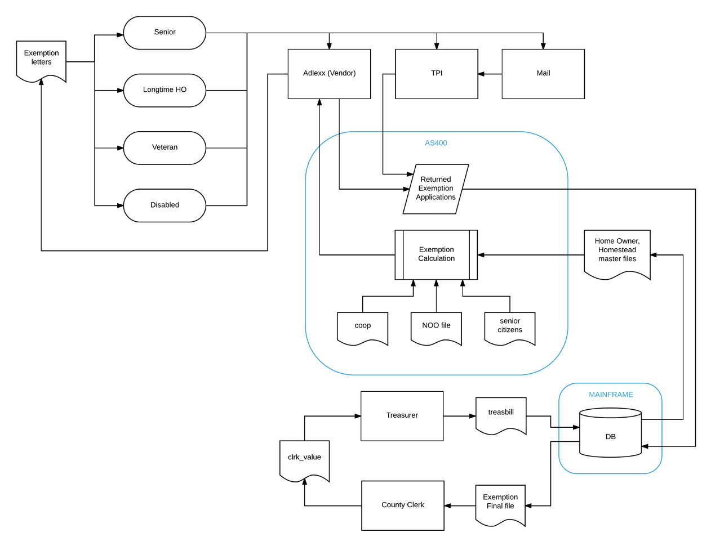

 

## Changes for Tax Year 2019

Updates to forms and processes

2019|2020
----:|----
"Senior Citizens Exemption"|Renamed Senior Exemption
"Disabled Veterans Exemption"|Renamed Veterans with Disabilities Exemption
"Disabled Persons Exemption"|Renamed Persons with Disabilities Exemption
No exemption applications were available online.|Homeowner, Senior, and Senior Freeze are online. They are linked on each exemption’s web page.
Exemptions: accept/reject via the mail.|For online applicants, notification via email.
Taxpayers with leases applied for exemptions via Certificates of Error.|Can apply for current tax year (must see a manager).
Occupancy Affidavit: attestation by someone other than applicant.|Applicant now attests to their own occupancy of the property.
Homeowner and Senior Exemptions were on the same form.|These exemptions are now on separate forms, as they have different eligibility and document requirements.
Listed accepted ID documents: drivers license, state ID.|Lists are greatly expanded to match eligibility requirements for ID, occupancy, and taxpayer status.
Must renew Senior Exemption every year.|Now the Senior Exemption is renewed automatically.
Didn’t ask for last 4 of SSN.|Senior and Senior Freeze forms request (optional) the last 4 of SSN. 
__Mailers:__ Two senior-related mailers: _purple_ "full" booklet for deed changes (Homeowner, Senior, Freeze) and the _blue_ “senior renewal” booklet that included the Senior and Freeze.|This “Senior” group was broken into 3 categories. _Blue_ mailer: modified to just renew the Freeze. _Gold_ mailer: new. Is the “full booklet” renewal mailed to prior recipients of the Senior who may be deceased. _Postcard:_ new. Confirms Homeowner and Senior auto-renewal so that no action is necessary.

### Resources for taxpayers
* Link directly to https://www.cookcountyassessor.com/exemptions
* Site contains a brief overview of all exemptions, with links to each one
* Lists the documents required with application
* Printable PDF applications and online submission available when possible.
* It has important notes for anyone applying for exemptions

 
## 

Process Flowchart
 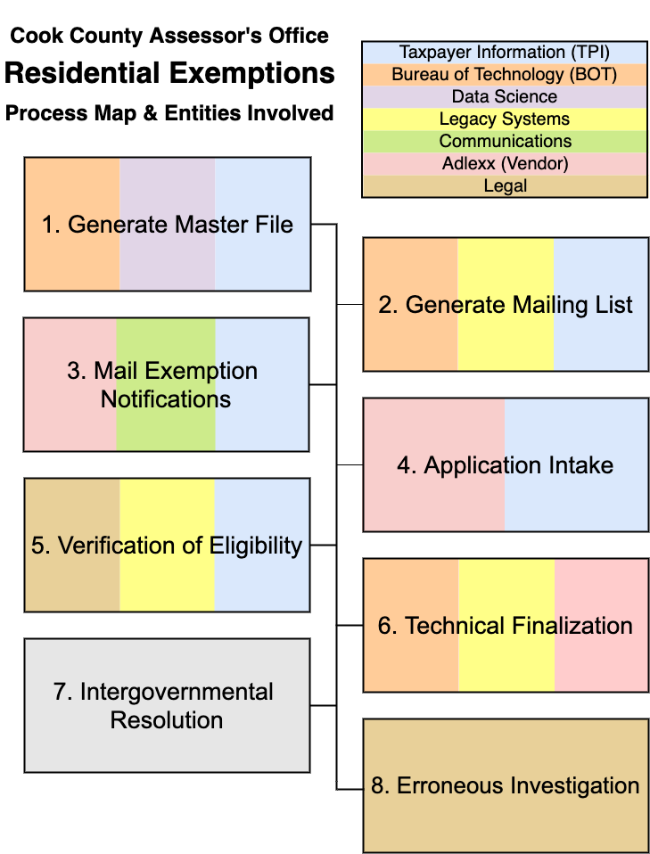

 

## 

Gantt Chart: Schedule & Relationship Dependencies
 

# 1. Generate Master File

Departments Involved | Programs &   Technology Employed
:-------------------:|:---------------------------:
Bureau of Technology (BOT) | Mainframe 
Taxpayer Information (TPI) | Homestead Update Interface (HUPD)
Data Science | AS400
Legacy Systems |

## Description
####Generates list of taxpayers who are likely eligible for exemptions (“Master File”).
####These will be informed of their eligibility, status and the next steps to take to receive their exemption.

## Details

__1.1.__	Create a copy of last year's Master File for use in current tax year  

- Backup prior year HUPD file
-	The file is updated nightly with assessment and exemption information from Board of Review data sets.
- PTI: Change the nightly back up (new file scheduler)
- BOT: Enable HUPD transactions on Mainframe
    - HUPD is a program that interfaces directly with the Mainframe
    - TPI can use it to update the records directly
    - HUPD is technically a noun, but is often used as a verb as jargon for "use the HUPD to access the Mainframe"
- 

 
  
Associated files, programs & naming conventions

  -	  Conversion program: `TRIPT761`
  -	  Panvalet record description: `ASREASRDU3`
  -	  Run-A-job: `TRIPT63T` 
  -	  FTP file name example: `AS.REA.ASMTMSTR-MF-120817.TXT` 

    -	  
 
    
Data dictionary & documentation

        - [as.rea.asmtmstr.csv](new/as.rea.asmtmstr.csv)
            - NB: each field is interspersed with a '|' delimiter, omitted here.
            - [Original](orig/VSAM_layout.docx) (S. Pham 2017) 
        - The Assessor property master is a __VSAM__ file that has detail segment data for all Cook County properties: land data, improvement data and questionnaire data.
            - __V__irtual __S__torage __A__ccess __M__ethod, IBM data structure circa 1970.
        -	 The file name the mainframe uses is `AS.REA.ASMTMSTR`
        -	 The converted output file will be a variable length file. 
        -	 Bytes 1 – 273 will always be on each record as defined below. 
        -	 File length is variable.
            -	After byte 273, the data format will vary depending on what variable segments the records will have.
            -	 Minimum length is 273. 
            -	 Maximum length is 273 + (118 * 200) = 23,873.  
            -	 118 is the variable segment data length for all segments
            -	 200 is maximum number of segments.  
        - Each record can three distinct types of segments all 118 bytes in length. They are:
            - _Sales segment:_ 
                - This segment can exist only once on each record. 
                - You must inspect the value of ‘Sales segment counter’ in byte 264.
                - If the value is ‘zero’ then the record will have no Sales	segment.
                - If the value is ‘one’ the record will have a Sales segment.
                - The Sales segment, if it exists, will always follow the fixed data of the record.
                - It will always be in bytes 274 to 391 on the record. 
            - _Detail segments:_ 
                - These segments can occur up as many times as the value in the field called ‘Detail/Questionnaire segment counter’. 
                - There are five different types of Detail segments.
                    - Type 1 – Land
                    - Type 2 – Improvement
                    - Type 3 – Improvement
                    - Type 4 – Improvement
                    - Type 5 – Improvement
                    - In order to determine what kind of Detail segment you are dealing with you must inspect the value in the field called ‘Type’, which will be in the fifth byte of every Detail segment. 
                - If no Sales segment exists, the Detail segment will followed the fixed data in bytes 274 to 391.
                - If a Sale segment exists then the first detail segment will follow it in bytes 392 to 509. 
            - _Questionnaire:_ 
                - This segment will always follow directly behind a Detail segment if that Detail segment is either Type 2, 3, 4 or 5 and the Detail segment field called ‘Class’ has a value of 202-212, 234, 278, 295, 402-412, 434, 478 or 495.  
                - The field ‘Class’ will be in bytes 13-15 in all of the Detail Type 2-5 segments. 
                - When dealing with the variable segments you will have bump through the record after the fixed portion by 118 bytes as many times as the counters in the fixed portion of the record tell you in order to process all the variable data.

  

__1.2.__ Removal of deceased taxpayers

-	An application may return with a signature from an estate executor or, notification is received from a family member.
-	An Executor must submit authorization to execute and Death Certificate.
-	TPI works with Systems to delete PINs: uses the Exemptions homestead file from the prior year to remove deceased seniors or to make adjustments
-	Data Science working to utilize other county and state databases to match ineligible taxpayers to properties

__1.3.__	Open new tax year HUPD file

-	Systems Department typically calls BOT to request opening of the Mainframe HUPD transactions sometime in October of every year, prior to preparing exemption mailings which start in January of the following year.
- This is in preparation for the exemption and tax processing. BOT opens a new year with no PIN numbers and updates the menu/options/screens to point to the new year - which is empty
- BOT downloads the Mainframe file to the AS400

__1.4.__ Integrity & Quality Assurance Testing

- TPI keys 4 or 5 PINs for Prime applications (new senior applications)
- BOT runs a nightly cycle, and downloads the Senior and Homeowner File to the AS400
- Systems validates the test PINs and notifies TPI

__1.5.__ New file reconciliation

- TPI enters all Prime applications received prior to mailing and applications received thereafter directly to Mainframe.
- BOT disables HUPD upon request from TPI, triggers appropriate jobs to update for all other users (e.g. Clerk, Treasurer)

#2. Generate Mailing List

Departments Involved | Programs &   Technology Employed
:-------------------:|:---------------------------:
Bureau of Technology (BOT) | Mainframe 
Taxpayer Information (TPI) | AS400
Legacy Systems |

##Description
####Use Master File to create list of addresses associated with potential exemption eligibility.

##Details

__2.1.__ Build Sales File for mailings

* __Query Basis:__ Properties sold in past year likely indicate change in exemption eligibility, if only from one taxpayer to the next.
    * 

Query syntax

        * RUN FOLLOWING JOBS TO CREATE PRIOR YEAR SALES FILE WITH SALES GREATER THAN 1 DOLLAR (VALID SALES)
        * Library `DATAC`

        | AS400 Query | Note | Input File |
        |-------------|------|------------|
        RMMSALEA|USE PRIOR YR SALES MD FILE|SELECT DEED`YYYY` PRIOR YEAR
        RMMSALEC|USE CURRENT YR SALES MD FILE|SELECT DEED`YYYY` PRIOR YEAR
        RMMSALED|IDENTIFIES DUPLICATE RECORDS|n/a
        RMMSALEE|ELIMINATES DUPLICATE RECORDS|CHANGE YEAR IN ‘DEFINE DATABASE FILE’ TO PRIOR YEAR (E.G. `SALE2017W0/DATAC`)
        RMMSALEF|SELECT SALEPRICE GREATER THAN ‘1’|CHANGE YEAR IN ‘DEFINE DATABASE FILE’ TO PRIOR YEAR (E.G.`SALE2017G0/DATAC`)

* Re-run prior year’s sales for new year Processing and replace file on `SALE2013C` with new year.
* Changed to `PTAX203` from Recorder file on 11/10/2015
* `SALE2014A` with `PTAX203` prior year file
* `SALE2014C` with `PTAX203` current year file 
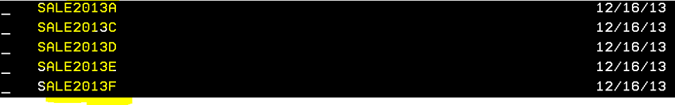 
* Copy Queries to New Tax /Exemption Year 
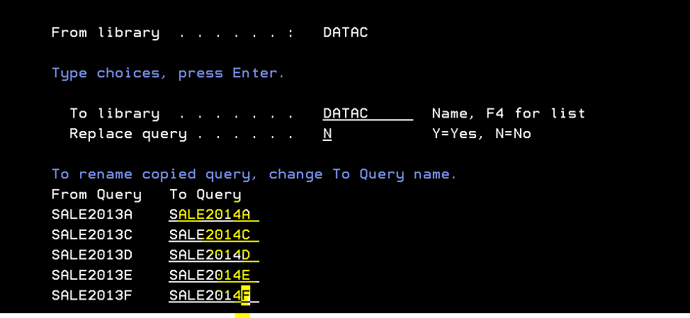 
* Run `SALE2014A` now (6/3/14), then re-run all files by December before mailing
* Build files for AS400 menu (option #29) 
 
* Ran on 11/10/2015 as test file, re-run when BOT creates 2015 `HOMOWNMST` file
* Have SYSTEMS (STEVE) upload file from `SALESADJ01` 
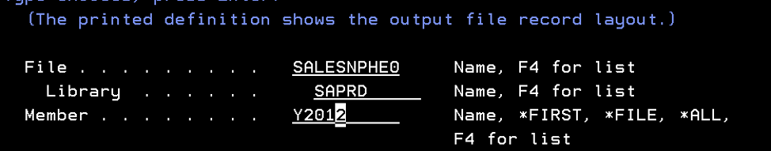 
* Change to 2014 for 2014 Tax year
* Build 10 year sales history 
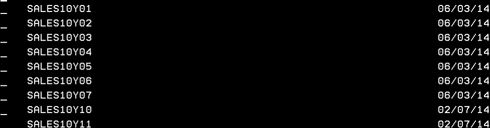
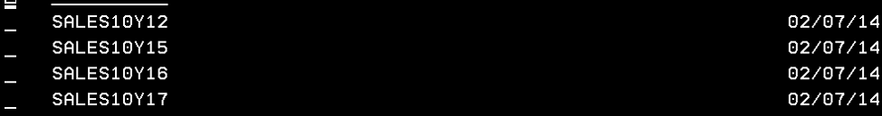 
* After `SALES10Y17` re-run `SALES10Y6`, -`7`, -`10` and -`11` 
* Creating properties where age = 10 or greater 
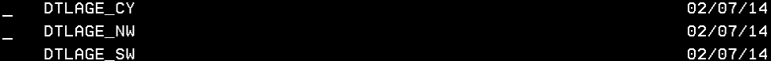 
* For long-time mailing 
 
* Run when preparing to mail LT
* Early No_file 
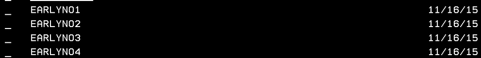 
* Look at write-up for No-File (contact Kathy Lee)

__2.2.__ Create 10 year age property file

-	This is used to calculate means-tested percentage exemptions
-	__Query Basis__: has the taxpayer received the homestead exemption for at least nine consecutive years __OR__ previously received a long-term exemption?
    - 

Query syntax

        - IF CURRENT TAX YEAR =TRI YEAR, THEN AGE =10
        - IF CURRENT TAX YEAR =TRI YEAR-1, THEN AGE=9
        - IF CURRENT TAX YEAR =TRI YEAR-2, THEN AGE =8
        - Library `DATAC`
        
        | AS400 Query | Result | Output File |
        |-------------|--------|-------------|
        DTLAGE_CY|CITY PINS (CURRENT TRI YEAR, AGE=10)| DTLAGE/DATAC
DTLAGE_NW|NORTHWEST PINS (TRI WAS TWO YEARS AGO, AGE=8)| DTLAGE/DATAC
DTLAGE_SW|SOUTHWEST PINS (TRI WAS ONE YEAR AGO, AGE=9)| DTLAGE/DATAC
LTOWN01|CHANGE MEMBER YEAR TO CURRENT ON OUTPUT FILE|LTOWN01
LTOWN02|ELIMINATES DUPLICATES|LTOWN02

-	Known by the names:
    - Long-time Homeowner Exemption
    - Long Term Occupant Exemption
    - LT4 (Long-term 4%; income < $75,000)
    - LT2 (Long-term 2%, income $75,000 - $100,000)
    - LT7 (Better than Senior Freeze)
- Process in AS400
    

    
 Create Database 

    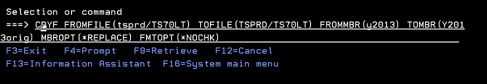 
    
* run `tslstbuil1/datac` 
    
    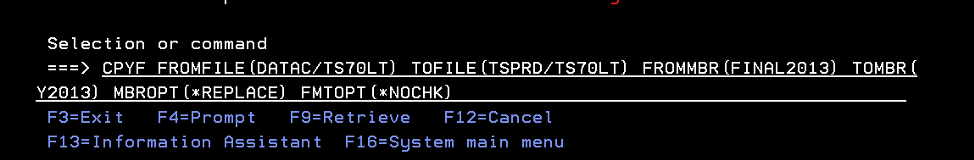
    

    

    
 Calculate LT4 & LT2 Exemptions: 

    - New queries: Run `PRORAT3` and `PRORAT4` BEFORE FOLLOWING QUERIES 
    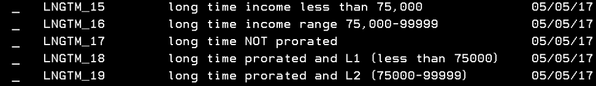
     
    - Run `CHK297_02` AS FILE AND REPORT 
	 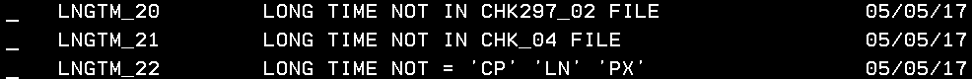 
    - Run following query after LNGTM_20 and before LNGTM_21 
	 
	 
	 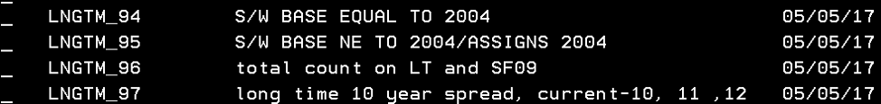 
    - Give Lumni following reports (‘R’ for report, ‘F’ to create file): 
    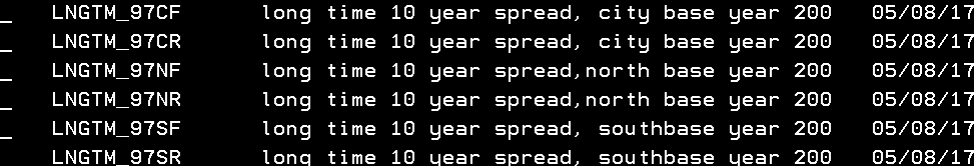 
    - Wait for approval before uploading ASREA86X (LNGTM_90/DATAC) file 
	  
    - Wait for approval before uploading ASREA86X (LNGTMFX2/DATAC) file
    - Old queries: change years and State Equalizer 
	 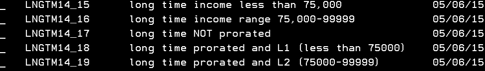
	 
	 
	 
	 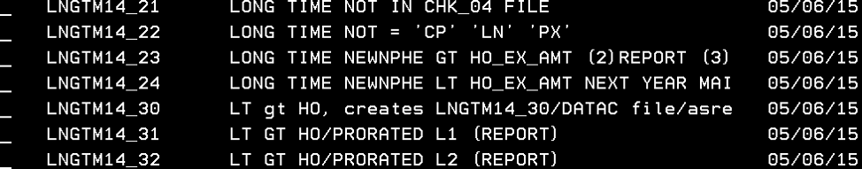
	 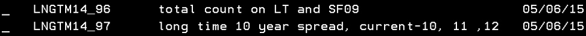 
    - Give Lumni reports:
        - 14_23
        - 14_31
        - 14_32
        - 14_96
    - Wait for approval before uploading `ASREA86X` (LNGTM14_30/DATAC) file 
    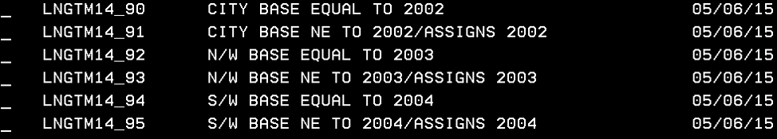 
    - Wait for approval before uploading `ASREA86X` (LNGTM14_90/DATAC) file
    - To ‘fix’ PIN’s whose LT should equal 7000, run following queries (data entry of pins in both queries (FX1 to assign 7000, FX2 to include remaining LT PIN’s): 
    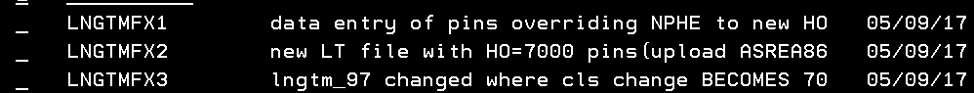 
    - MISC QUERIES 
	  
	 
	 

	 
	 

	 
 Calculate LT7 Exemptions

        - Files Needed: 
        
        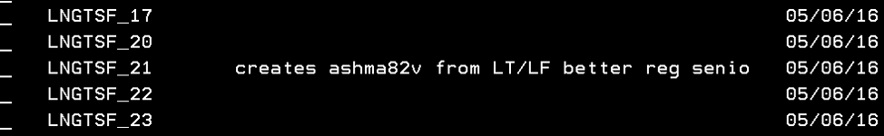 
        - GIVE LUMNI the following reports:
        - Once approved, run `ASREA86X`
        - Sndnetf following file: 
         
        - ASHMA82V 
        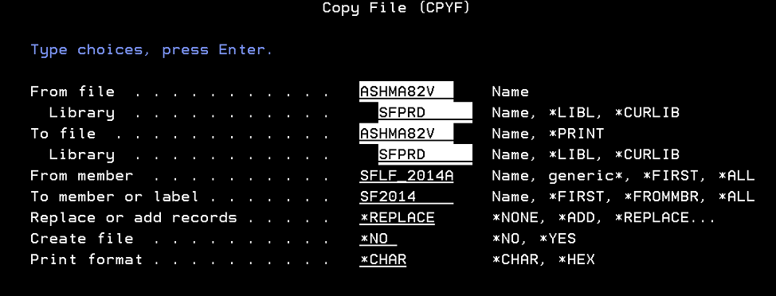 
        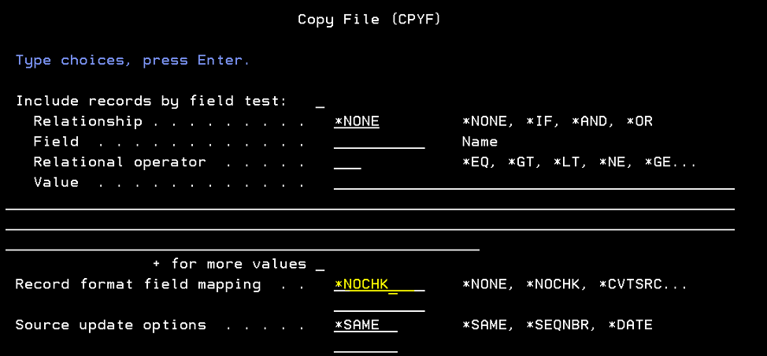
        
        
        
    

    

__2.3.__ Update ‘HOMEOWNER NO FILE’

* Mainframe Data Filename: `A.AS.HMA.NOFILE15-NOFILE15-MF-050616.txt`
* TPI gets Senior Lexus/Nexus ‘NO’ file PINs & uploads to Homeowner NO-FILE
* Upload can be run multiple times during year
* Change  JCL for new year (one time) 

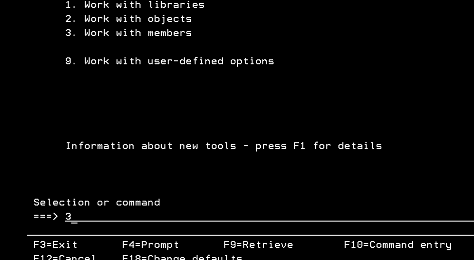
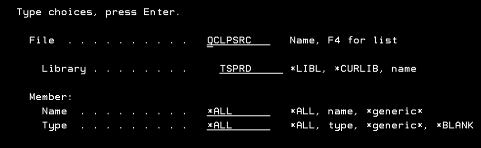
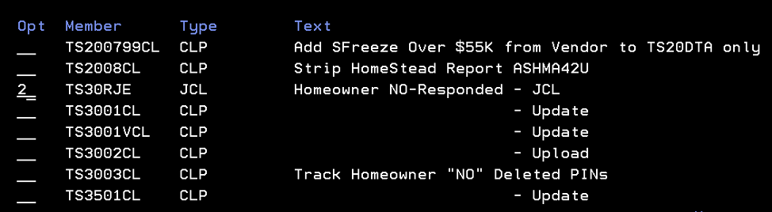
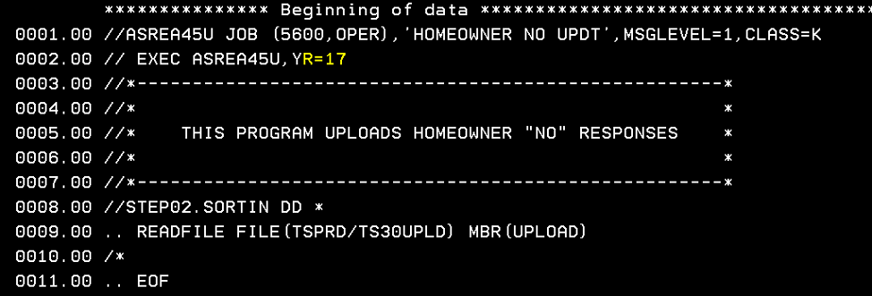
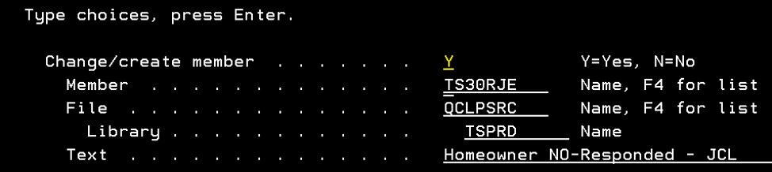
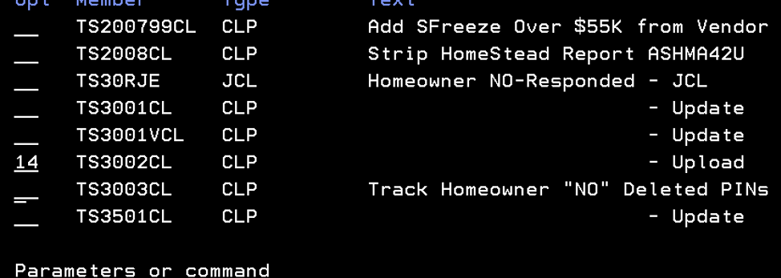
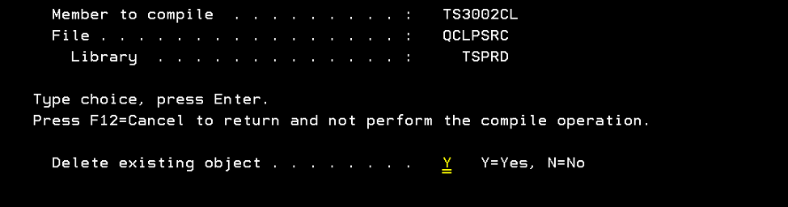 
* During MIS processing, only run when requested by BOT (after SF processing and before 7%)
* Make sure no one is on the AS400 “no-file” prior to running following jobs 
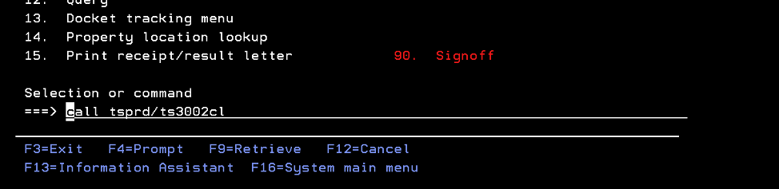
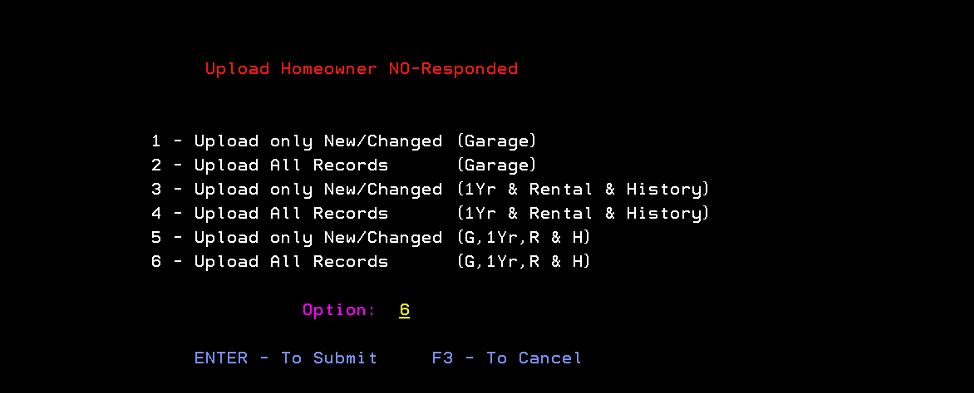 
* Screenprint counts
* Produces `ASREA45U` job (check JHS) 

__2.4.__ Mainframe generates Mailing Files

* Senior & Senior Freeze Exemption
    * Systems/TPI requests BOT send `HSRENEW` and `HOMOWNMST` files 
    * BOT transfers file from Mainframe to AS400
    * Systems generates the Senior Renewal and Senior Freeze mailing files on the AS400, filtering out persons that should not be on the list, in order to narrow it down to the accurate final mailing list
    * 

Process on AS400

        * Update `SENMAIL1CA`, -`CB`, -`CC`, -`CD`,-`FA`, -`SA`, -`2FA`, -`2FB`, -`2SA`, -`1SA` 
        
        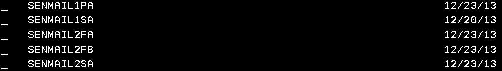
        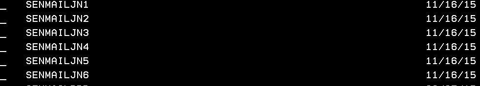
        
        
         
        * Copy file to: Cpyf 
        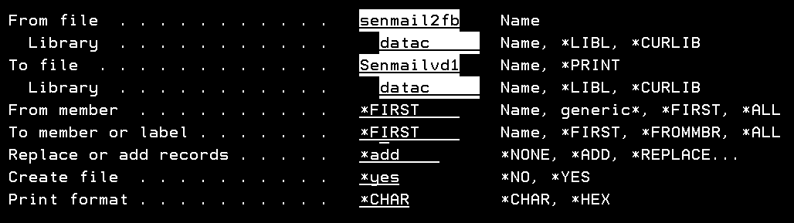
        
        * SENMAILF05,01 ---- Brian’s PIN file built from Nexus Lexus (check with Jason Pyle). 
        
        
        
        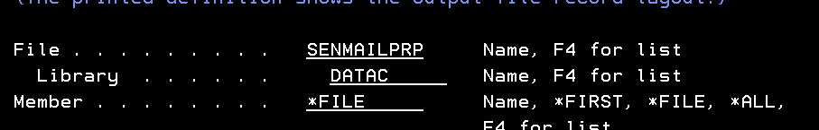
         
        * Place file in G:\WebExemptions\Mail YYYY\Senior Mailing.txt and zip file and send to Vendor
        * Following provides counts. Check with Lumni on mailing SENMAILCT3 ( C oFE) 
        
        * 

AS400 Query Detailed Explanations (N. Bernacchi 01/15/2020)

            
            [Query Dictionary (.csv)](p2.4/a/sr_mailing_queries_bernacchi.csv)
            
            | AS400 Query | Result | Output File |
            |-------------|--------|-------------|
            |SENMAIL1CA/DATAC|SELECTS PINS WITH PRIOR YEAR SENIOR C OF E AND NOT ON PRIOR YEAR COOP FILE& ASSIGNS CODE "1C"|SENMAIL1CA/DATAC|
|SENMAIL1CB/DATAC|SELECTS PINS FROM SENMAIL1CA AND COMPARES FILE TO CURRENT HOMSTDMST/MASTERS FILE& ASSIGNS CODE "1C"|SENMAIL1CB/DATAC|
|SENMAIL1CC/DATAC |SELECTS PINS FROM SENMAIL1CA EQUAL TO PRIOR HOMSTDMST/MASTERS FILE, NOT EQUAL TO CURRENT|ADDS TO OUTPUT FILE SENMAIL1CB/DATAC|
|SENMAIL1CD/DATAC|SELECTS PINS FROM SENMAIL1CA EQUAL TO   PRIOR PRIOR (2YEARS)  HOMSTDMST/MASTERS FILE, NOT EQUAL TO CURRENT& AND NOT EQUAL TO PRIOR|ADDS TO OUTPUT FILE SENMAIL1CB/DATAC|
|SENMAIL1FA/DATAC|SELECTS PINS FROM PRIOR SF FILE AND PRIOR HOMSTDMST& ASSIGNS CODE "1F"|SENMAIL1FA/DATAC|
|SENMAIL1PA/DATAC|SELECTS PINS FROM CURRENT HOMSTDMST/MASTERS& ASSIGNS CODE "1P"|SENMAIL1PA/DATAC|
|SENMAIL1SA/DATAC|SELECTS PINS FROM CURRENT YEAR HSRENEW/MASTERS FILE AND NOT ON SF FILE& ASSIGNS CODE "1S"|SENMAIL1SA/DATAC|
|SENMAIL2FA/DATAC|SELECTS COOP PINS FROM PRIOR SF09 FILE|SENMAIL2FA/DATAC|
|SENMAIL2FB/DATAC|SELECTS PINS FROM SENMAIL2FA COMPARES FILE TO PRIOR HOMSTDMST/MASTERS AND MATCHES ON BIRTHDATE& ASSIGNS CODE "2F"|SENMAIL2FB/DATAC|
|SENMAIL2SA/DATAC|SELECTS COOP PINS FROM PRIOR HOMSTDMST NOT ON SENMAIL2FB FILE OR PRIOR HOMSTDMST PINS EQUAL TO SENMAIL2FB BUT BIRTHDATES DO NOT MATCH & ASSIGNS CODE "2S"|SENMAIL2SA/DATAC|
|SENMAILDV1/DATAC|SELECTS PINS FROM SENMAILSA1/DATAC NOT ON DVVOIDPIN/DVPRD FILE|SENMAILDV1/DATAC|
|SENMAILDV2/DATAC|SELECTS SENMAILSA1/DATAC AND DVVOIDPIN/DVPRD TO ADD NEW PIN |ADDS TO SENMAILDV1/DATAC|
|SENMAILJN1/DATAC|SELECTS PINS FROM SENMAIL1FA AND SENMAIL1SA WHERE SENMAIL1FA NOT EQUAL TO SENMAIL1SA OR SENMAIL1FA EQUAL TO SENMAIL1SA BUT BIRTHDATES DO NOT MATCH  |SENMAILJN1/DATAC|
|SENMAILJN2/DATAC|SELECTS PINS FROM SENMAIL1SA AND SENMAIL1FA WHERE SENMAIL1SA NOT EQUAL TO SENMAIL1FA OR SENMAIL1SA EQUAL TO SENMAIL1FA BUT BIRTHDATES DO NOT MATCH  |ADDS TO SENMAILJN1/DATAC|
|SENMAILJN3/DATAC|SELECTS PINS WHERE SENMAILJN1/DATAC NOT EQUAL TO SENMAIL1PA/DATAC|SENMAILJN3/DATAC|
|SENMAILJN4/DATAC|SELECTS PINS WHERE SENMAIL1PA/DATAC NOT EQUAL TO SENMAILJN1/DATAC|ADDS TO SENMAILJN3/DATAC|
|SENMAILJN5/DATAC|SELECTS SENMAILJN3/DATAC|SENMAILJN5/DATAC|
|SENMAILJN6/DATAC|SELECTS PINS ON SENMAIL1CB/DATAC BUT NOT ON SENMAILJN3/DATAC|ADDS TO SENMAILJN5/DATAC|
|SENMAILPRD/DATAC|CREATES DECEASED MAILING FILE (SENIOR_ROB/DATAC) BY ADDING MAILING NAME AND ADDRESS AND PROPERTY LOCATION|SENMAILPRD/DATAC|
|SENMAILPRF/DATAC|CREATES MAILING FILE FOR SENIOR FREEZES|SENMAILPRF/DATAC|
|SENMAILPRS/DATAC|CREATES MAILING FILE FOR SENIORS|SENMAILPRS/DATAC|
|SENMAILPRT/DATAC|SELECTS SENMAILPRS/DATAC FILE AND EXCLUDES SENIOR_ROB/DATAC PINS (DECEASED AS400 FILE)|SENMAILPRT/DATAC|
|SENMAILSA1/DATAC|SELECTS PINS FROM SENMAILJN5 NOT ON SALE2018GO/DATAC FILE|SENMAILSA1/DATAC|
|SENMAILVD1/DATAC|SELECTS SENMAILDV1/DATAC AND CURRENT ASMASTER/MASTERS AND EXCLUDES ANY PIN ON NO-FILE|SENMAILVD1/DATAC|
        

        

* Long-term Exemptions
    * Create data entry file (`TS70LT`/`TSPRD`)
    * 

Process on AS400

        * NOTE: for 2017 ran NPHEC with 17 and NPHEN and S with query name 16. (run same yr queries but change the HOMEOWNER,  ASMASTER and SE )
        * Use all `xxxxx17_xx` Queries  
         
        * __DO NOT COPY QUERY AND RENAME THEM FOR CURRENT YEAR__
        * CITY  
        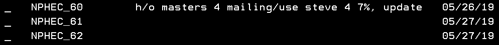 
        * NORTH  
        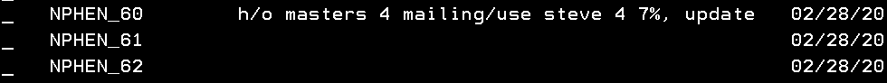
        * SOUTH  
        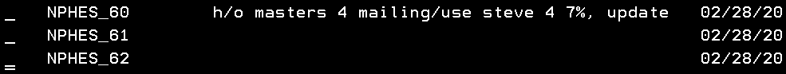
        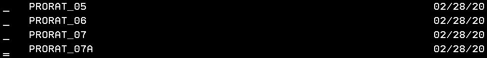 
        * CITY  
        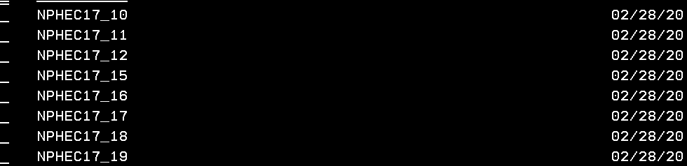
        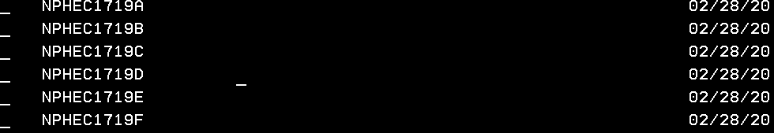
         
        * For new year, copy over last query and renamed it with the following letter (eg. `NPHE1719O`) 
        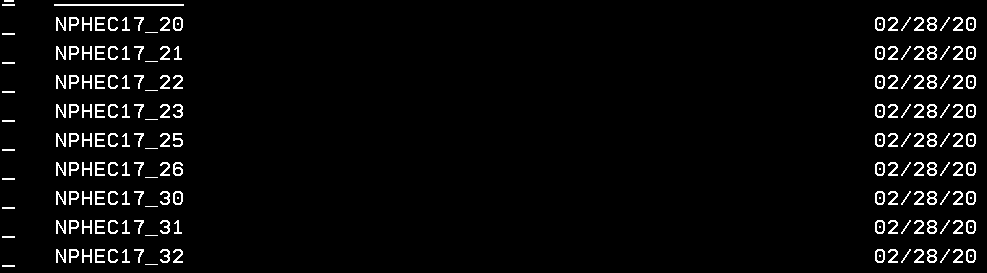 
        * NORTH
        
        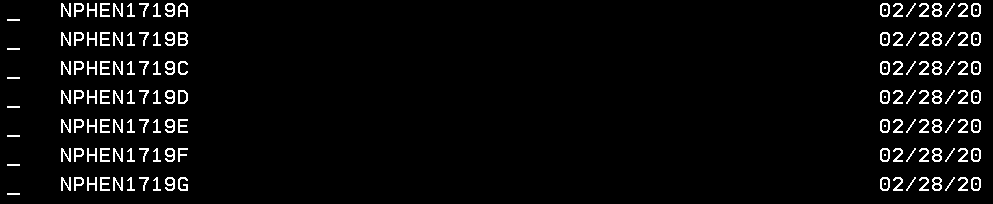
        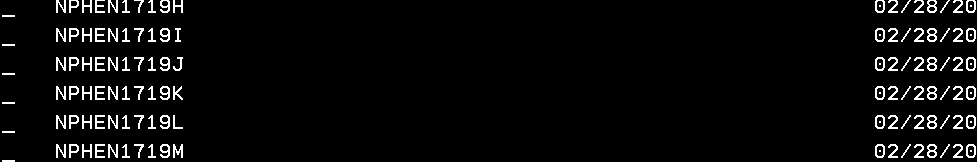 
        * For new year, copy over last query and renamed it with the following letter 
        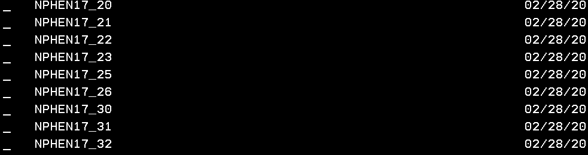 
        * SOUTH  
        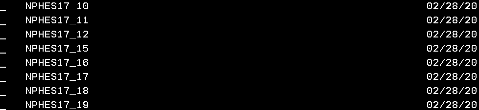
        
         
        * For new year, copy over last query and renamed it with the following letter 
        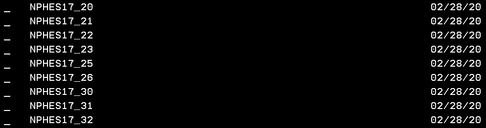
        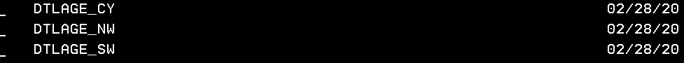
        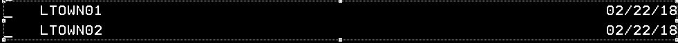
        
        
        
        
        
        
        
        * Send `NPHELTAU`3 to WEB EXEMPTIONS FOLDER 

    * Homestead Exemption
        * Systems requests Homeowner File from BOT (Master File in Mainframe used to generate)
        * BOT transfers file from Mainframe to AS400
        * Systems runs queries on AS400 according to this logic:
            * _No Exemption:_ If property owner lives in the home, and there is no recorded sale, but they have secondary property on file, then no exemption option is given to the second property.
            * _Yes Exemption:_ If property owner received the home owner exemption last year, and did not sell it, then exemption renews automatically.
            * _No Mailing:_ PIN is in the “No” file (PINs are for rental, common areas, parking spaces, or some other ineligible category).
            * Systems runs further queries to define if the Assessor has heard from property owner in 3 years 
                * These have incredibly low response rate and do not receive mailed notifications)
        * 

Apply Lucky 777’s to Homeowner Master file

            * What is this? 
            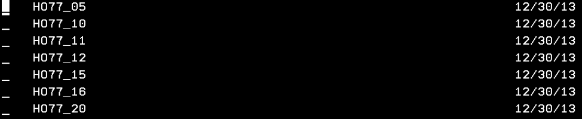 
            * Change SYSDTE on HO77_20
            * Copy output file from HO77_20 over to TS40DTA/TSPRD YNN_7777S 
            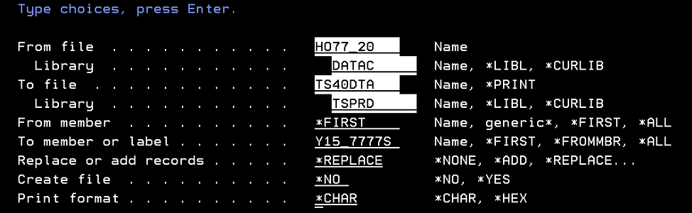
            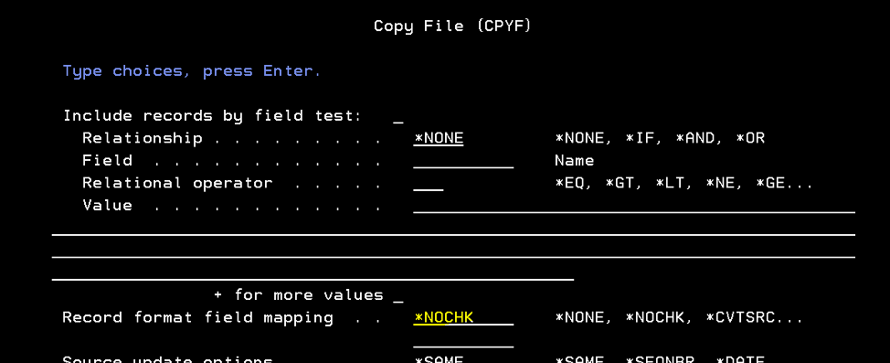 
            * Have Steve Pham upload file TS40DTA/TSPRD YNN_7777S 
            

            * 

Create the booklet mailing file

                * After running the following, place output file into G:WebExemptions\Mail`yyyy`\Booklet Mailing `YYYY` final
                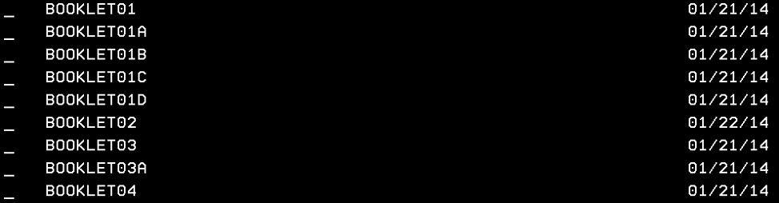
                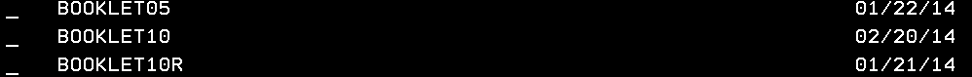
                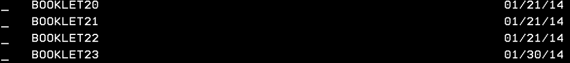
                

            * 

Other, less voluminous mailing files 

                * Disabled Persons Exemption
                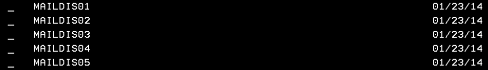
                * Veterans Exemptions
                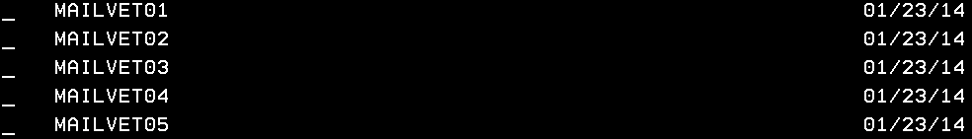
                * ~~Sunset~~ (Expired in 2014)

__2.5.__ Systems FTPs mailing text file to vendor (see 2.4 details)

__2.6.__ Create Senior Reminder mailing file 

* Run only `SRREMIND5` and send file to Vendor (`SRREMIND5/DATAC`)
* Run `SRREMIND5`, `5A` and `5B` if requested by TPI to not include prior year batch=4. Send file to vendor (`SRREMIND5B/DATAC`). 
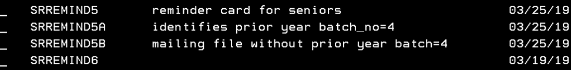

#3.	Mail Exemption Notifications
Departments Involved | Programs &   Technology Employed
:-------------------:|:---------------------------:
Taxpayer Information (TPI) | 
ADLAXX (Vendor) |
Communications |

##Description
####Taxpayers are mailed information about the exemptions for which they may qualify. 
####The information sent is dependent on the data TPI has about each taxpayer.
##Details


__3.1.__ Communications department sends mailer designs to vendor

* [Senior Freeze ("Blue Booklet")](orig/SF_ap.pdf) 
* [Full Application ("Purple Packet")](orig/full_ap.pdf)
* [Senior Prime ("Gold Packet")](orig/gold.pdf)
* [Automatic Renewal Postcard](orig/postcard.pdf)
* [Long-Time Homeowner](orig/lte_ap.pdf)
* [Persons with Disabilities Renewal](orig/pwd_r.pdf)
* [Veterans with Disabilities Renewal](vwd_r.pdf)

__3.2.__ Vendor assigns barcode to property index numbers

* Barcode scanning allows for easy data entry, matching PIN to application
* Not all applications are returned to vendor, so TPI must be able to handle the ones that arrive
* Vendor and TPI coodinate to test barcode system

__3.3.__ Vendor mails notifications

* This process is outsourced because it is unskilled-labor intensive.
    * Vendor uses mailing files generated in previous subprocess to determine which mailers go to which addresses.
    * Garbage in, garbage out: the vendor does not parse the list beyond what is given to them.
* Mailing file sent to vendor includes:
    * PIN
    * Taxpayer birth date
    * Type of property
    * Address

__3.4.__ Determination of mailer is different in 2020 due to automatic renewal of Senior Exemption.

    
* 

Decision Tree Effective 2020 (tax year 2019)
 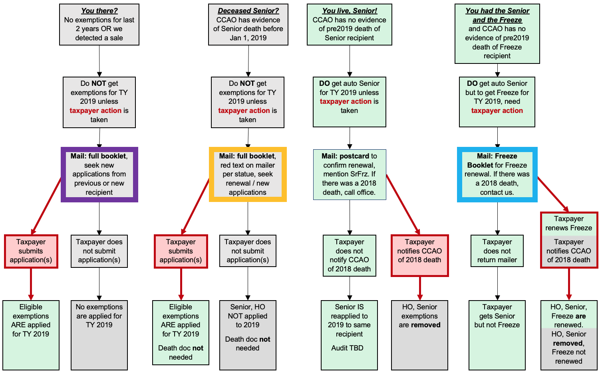

* 

Deprecated Decision Tree (2019/tax year 2018 and earlier)
 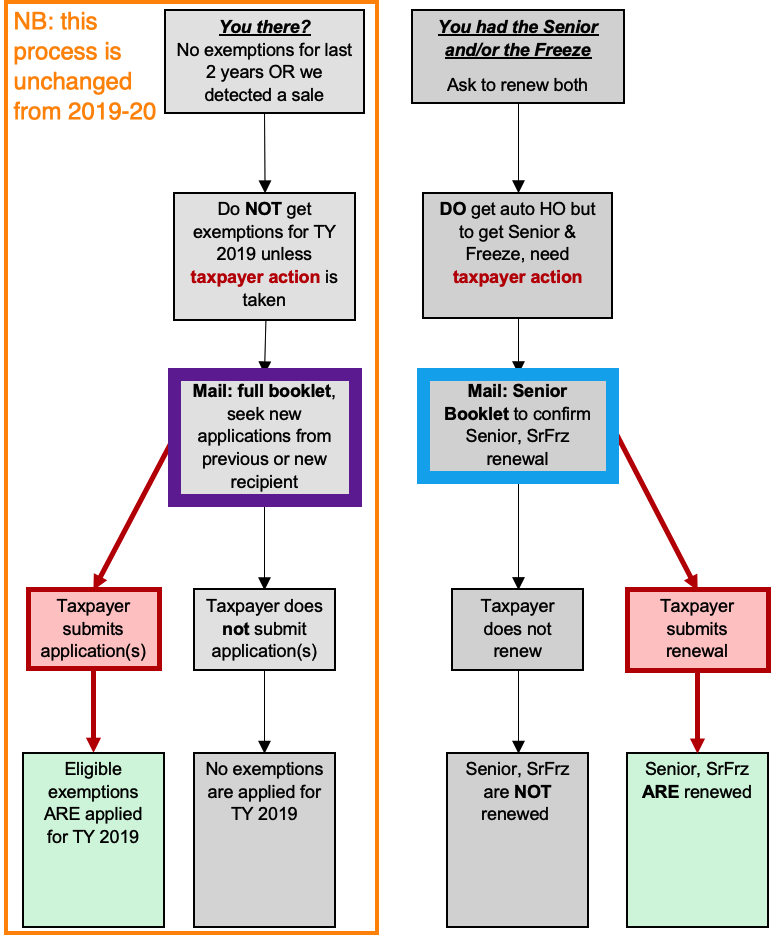

#4.	Application Intake

Departments Involved | Programs &   Technology Employed
:-------------------:|:---------------------------:
Taxpayer Information (TPI) | Mainframe
ADLAXX (Vendor) | AS400
Legal: Freedom of Information (FOIA) |

##Description
####Applications for exemptions are received from several channels.

##Details

__4.1.__ Most applicactions are submitted as hard copies. 

* The ability to file online is new in 2020; this is now available for the so-called "Big Three" Exemptions.
* Each electronic application is available from the relevant subpage of the CCAO website. All e-File submissions are completed through DocuSign.
* These exemptions may be submitted either online or on paper:
    * [Senior](https://www.cookcountyassessor.com/senior-citizen-exemption) | [.pdf](https://prodassets.cookcountyassessor.com/s3fs-public/form_documents/SeniorExemption_0.pdf?VP7enzbQMrsgMomTduWHBdTCWogKOsLd)
    * [Senior Freeze](https://www.cookcountyassessor.com/senior-freeze-exemption) | [.pdf](https://prodassets.cookcountyassessor.com/s3fs-public/form_documents/SRFrz.pdf?saks82xchFD1dNR9g57H5SESrDKN.lYg)
    * [Homeowner](https://www.cookcountyassessor.com/homeowner-exemption) | [.pdf](https://prodassets.cookcountyassessor.com/s3fs-public/form_documents/HoHs.pdf?F1zIMMbRdjcsK.hwrNoXv9k7fw8gvB6C)
* These exemptions may be submitted only on paper:
    * [Persons with Disabilities](https://www.cookcountyassessor.com/persons-disabilities-exemption) | [.pdf](https://prodassets.cookcountyassessor.com/s3fs-public/form_documents/PersonswDisabilitiesEx.pdf)
    * [Returning Veterans](https://www.cookcountyassessor.com/returning-veterans-exemption) | [.pdf](https://prodassets.cookcountyassessor.com/s3fs-public/form_documents/ReturningVeteransEx.pdf)
    * [Veterans with Disabilities](https://www.cookcountyassessor.com/index.php/veterans-disabilities-exemption) | [.pdf](https://prodassets.cookcountyassessor.com/s3fs-public/form_documents/VeteranswDisabilitiesEx.pdf)
    * [Longtime Homeowner](https://www.cookcountyassessor.com/index.php/longtime-homeowner-exemption) | [.pdf](https://prodassets.cookcountyassessor.com/s3fs-public/form_documents/LongtimeExemptionApplication-2019.pdf)

__4.2.__ Most applicactions are mailed to the Vendor's Post Office Box 

* Property Owners seeking exemptions use the provided return envelope, which has a PO Box return address for vendor.
* Vendor keys data onto excel file
* Vendor sorts types of applications (vendor disallows longtime homeowner applications with income exceeding \$100k)
* Vendor emails final Excel files to TPI
* TPI sends Excel files to Systems
* Systems loads the excel files to the AS400

__4.3.__ Some applicactions come directly to CCAO

* This happens mainly because property owner does not want to send the application to a PO Box in a different county (where vendor is located).
    * Enough arrive during peak to keep several staff opening mail full time
* TPI receives direct in-person applications from the taxpayer themselves on Third Floor.
* Freedom of Information Department receives agent applications.
    * These are from professionals who file them on behalf of clients
    * FOI serves as buffer between professionals within TPI.
    * TPI deals only with principals, not agents.
    * FOI timestamps applications as recieved and delivers daily batches to TPI who process as normal.

__4.4.__ Internal Early Processing 

* Back Tax/Ommitted - for first installment tax bill.
    * Contact Felix/Dominick early December, deadline of Jan 5th
    * SNDNETF `BT01DTA/BTPRD/YYYY`
    * [Process](orig/process/1_BTO.html)
* Update files in `HOMEFZ` AS400 menu screen.
    * GO `TSPRD/HOMEFZ`
    * OPTION 3: CALL `TSPRD/TS40001CL` - HOMEWOWNER YES
    * OPTION 28: CALL `TSPRD/TS4005CL` - BASE YEAR ADJUSTMENT
* Contact Tanya (Clerk) for the Abatement pins spreadsheet. 
    * SNDNETF:  `ABATE_MIS/SYSOPS/ABATEYYYY`
    * `ASSRREA/COOKCNTYB/F...` MIS submits job
    * [Process](orig/process/6_AB.html)
* Expired Incentives new property - Incentives  Manager [Process](orig/process/4_INCENT.html)
* Veterans file - Legal Dept - Khang [Process](orig/process/7_BAVET.html)
* Duplicate pins in Division FROM/To file
    * Query = `chkfromto1` & `2` - `DVVOIDPIN/DVPRD`
* Upload an early "NO" file for AINQ so TPI sees on current exemptions 
    * earlyno1 thru 4 and sndnetf
* Senior Freeze w/no Seniors 
    * Q = `EX_VER_040` and `EX_VER_40C` - coops
    * Q = `CHKSF09YR` - SF birth year > 100 and/or sold last 10 years
    * Q = `CHKHS09YR` - Senior H/S birth year > 100 and/or sold last 10 years
* Number of Pins Current SF Equalized Assessed Value (EAV) less than Base Year EAV on prior year Qualified (Q’ed)
* SF Policing: Have SYSTEMS change years on following SF CL’s
    * Call `SFPRD/SF0106CL`: Change SF age 
    * Call `SFPRD/SF0106CLC`: Change SF age
    * Call `SFPRD/SF400082CL`: Change Process and Tax year 
    * Call `TSPRD/TS1002CL`: Change year for COOP Maintenance File
* Update `STPRD/LANDMARK` File
    * APIN (`ASAIS93B`)
    * Strip report file
* 

“EARLY” Queries: Run in `DATAC` library

    * `EX_VER_007`
    * `EX_VER_008` - Unmatched Birthdates
    * `EX_VER_010` - Voided PINs in HUPD File
    * `EX_VER_011` - Voided PIN’S in SF File
    * `EX_VER_001` - Non-Regression SF Pins
    * `SFDUP01`
    * `SFDUP02` - Check for SF duplicate PIN’s
    * `HSDUP01`
    * `HSDUP02	` - Check for HS duplicate PIN’s 
    * `CHKSFHSHO1` 
        * Compares `SF09` and `HOMOWNMST` for `STA1` and `STA2` counts
        * Run early and also after new `HOMOWNST` is built
    * `CHKSFHSHO2`
        * Compares `HOMSTDMST` and `HOMOWNMST` for `STA1` and `STA2` counts
        * Run early and also after new `HOMOWNST` is built
    * `CHKLTHO01`
        * Compares `TS70LT` (long-time file) and `HOMOWNMST` for `STA1` counts
        * Run early and also after new `HOMOWNST` is built
    * `CHKLTHO02`
        * Assigns `STA1`=1 to PINs not on `HOMOWNMST`
        * Have SYSTEMS upload `TS40DTA/TSPRD/YNNNN_LT` file to `HOMOWNMST`
    * `NOFILELT03` - Identifies LONG-TIME (LT) PINs in “NO” file
    * `CHKBDATESF` - Checks for bad birthdates on SF file
    * `CHKBDATEHS` - Checks for bad birthdates on HS file
    * `CHKNO01`-`CHKNO04` - Checks for prorated PIN’s in “NO” file
    * `NOFILESF03`
        * Checks for SF on “NO” file
        * Give to Lumni for review
    * `CHKNO05` - Checks for Division PINs on “NO” file
    * `CHKNO11` - Checks for SF and HS on “NO” file
    * `COESALADJ1`-`COSALADJ7`
        * Uploads COE’s (sales) for new Base
        * 

Process
 
        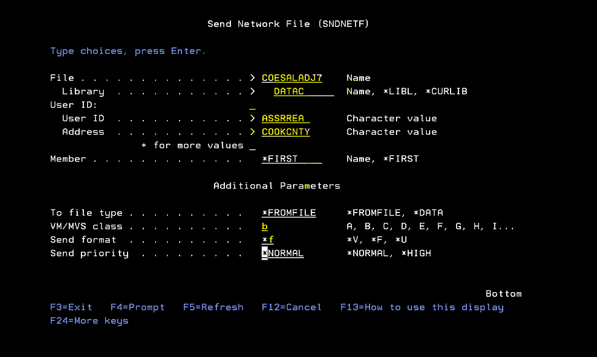 
            * Located in `APIN/assess00/asreajob` 

            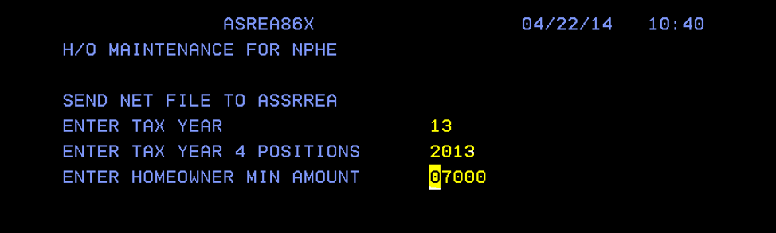
         
    * `COEHOMEOWN`
        * Uploads prior tax year COE’s to `HOMOWNMST` file
        * Have SYSTEMS upload `TS40DTA/TSPRD/YNNNN_COE` file to `HOMOWNMST`
    * `HOPRO11`, `HOPRO60`
        * Identifies single PIN prorations
        * Give to Residential dept 

#5.	Verification of Eligibility

Departments Involved | Programs &   Technology Employed
:-------------------:|:---------------------------:
Taxpayer Information (TPI) | Mainframe
Legacy Systems | AS400
Legal: Counsel |

##Description
####All exemptions have eligibility requirements; TPI and satellite offices verify taxpayers qualify and record documentation.

##Details

__5.1.__ Verification Process Abstract 

##### The following is a brief comparison of the seven major exemption types
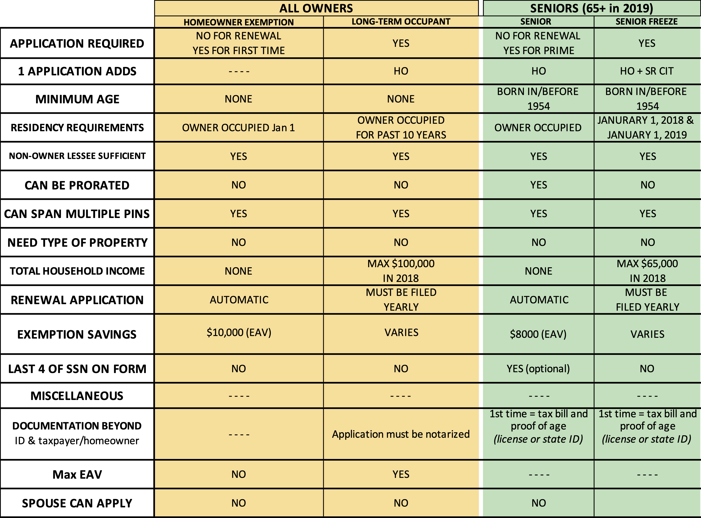 
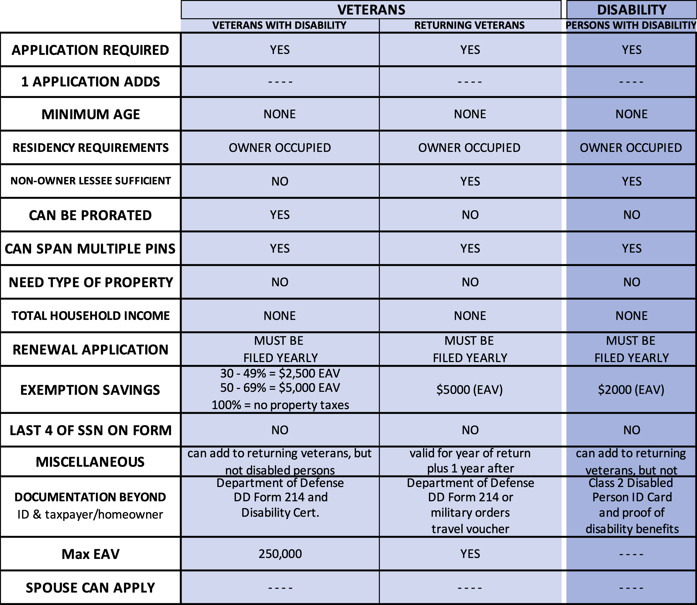
####Full Document | [.pdf](new/grid_full.pdf) | [.png](new/grid_full.png) | [.xlsx](new/2020_GRID.xlsx)

5.1.	Internal interface process with mainframe (COBOL):
5.2.	CCAO Legacy takes intake and puts it into AS-400.
5.3.	Information gathered is verified by against the Master File
5.4.	AS400 information translated into mainframe by BOT.

#6. Technical Finalization

Departments Involved | Programs &   Technology Employed
:-------------------:|:---------------------------:
Bureau of Technology (BOT) | Mainframe 
Taxpayer Information (TPI) | AS400
Legacy Systems |

##Description
All temporary files are transferred to the Property tax System of Record.

##Details

__6.1.__ Processing 

* BOT runs jobs 1 to 29 of the BOT MF Procedures to accomplish steps 59 to 68 in this document
    * Systems uploads updated/returned vendor files to AS400
    * Systems runs AS400 batch jobs to MF
        * This step updates the exemption file that is ready to be processed by BOT
        * AS400 uploads file to mainframe
    * BOT triggers MF jobs
    * MF validates accuracy: does a lookup for values in the MF table file. The MF has ~ 10 tables (or “TBs”), one for each exemption type
    * BOT provides QA Report (File download from MF)
    * Systems conducts manual QA: conducts error checking (standard queries) to make sure the files run correctly, and keep adding jobs to mitigate newly identified issues
    * __IF__ new applications are received during this process:
        * TPI directly enters all applications on to the MF
        * Systems repeats consolidation steps
    * Systems reviews file one last time
    * TPI and systems verify all exemptions and calculations
    * IDOR issues State Equalizer
    * Systems calculates exemption amounts
    * TPI notifies Clerk to proceed with tax processing

#7. Intragovernmental Resolution
Departments Involved | Programs &   Technology Employed
:-------------------:|:---------------------------:
Unknown | Unknown 
 | 
 |

##Description
Aenean a dolor plan et terror soulless vulnerum contagium.
##Details

__7.1.__ 

7.1.	CCAO sends results to the Clerk.  
7.2.	Clerk verifies/double-checks.
7.3.	Certification of Results: CCAO / Clerk meet and reconcile both verifications/processes. 
7.4.	Final certified results sent to Treasurer.
7.5.	Treasurer sends the final tax bill. 

* The Clerk reviews all exemption calculations in relation to prior year
* Clerk and Assessor meet to discuss results
* Changes to EAVs (equalized assessed value)
    * Senior = $5,000
    * Senor Freeze (income <$55K) = varies
    * Returning Veteran = $5,000
    * Disabled Veteran
        * 30% to 49% = $2,500
        * 50% to 69% = $2,500
        * 70% or more = exempt up to 250,000 EAV
    * Disabled Veteran Home Improvement = $70,000 AV
    * Homeowner = $7,000
    * Long-time Occupant exemption calculation:
        * <$75k, base year X 1.07 = exemption
        * >$75K to 100k, base year X 1.10 = exemption
        * From above, is 7% better? Give 7%
* NOTE: while this work is performed, the CL runs New Property jobs and TIF Jobs (in this order).
* Assessor makes changes: have to be coordinated with the CL. The assessor cannot make changes without CL’s collaboration.
* All Exemptions are accepted
* MF applies final calculation to the 2nd Installment tax bill
* Clerk Notifies the TR to proceed with Tax processing (print the tax bills)
* Did tax payer receive all entitled exemption?
    * If "Yes", then end of process. 
    * IF "No," then property owners must file COE to receive an exemption.

#8. Erroneous Investigation
Departments Involved | Programs &   Technology Employed
:-------------------:|:---------------------------:
Legal:Investigations | Docketing 
 | 
 |
##Description
Aenean a dolor plan et terror soulless vulnerum contagium.
##Details

__8.1.__ 

