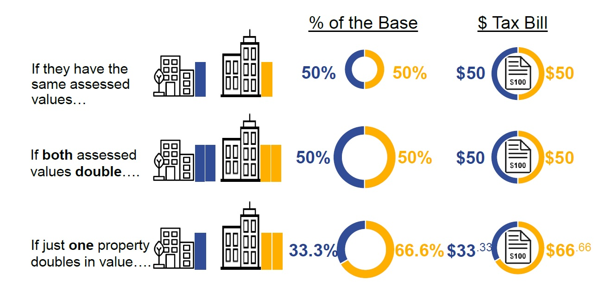
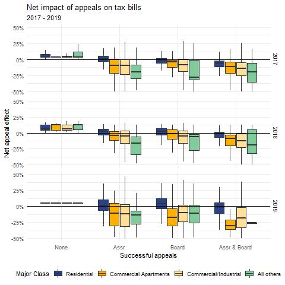

```{r setup, include=FALSE}
knitr::opts_chunk$set(echo = FALSE, fig.align='center', warning = FALSE, fig.align = "center")

# Load the necessary libraries
library(ggpubr); library(ccao); library(DBI)
library(ggplot2); library(gridExtra); library(htmltools)
library(htmlwidgets); library(jsonlite); library(knitr)
library(leaflet); library(lubridate); library(odbc)
library(readr); library(readxl); library(RSocrata)
library(scales); library(sf); library(stargazer)
library(testit); library(tidyr); library(tidyverse)
library(writexl); library(ccao); library(DT)
library(margins)

# Load
load('res_appeals_graph_data_1.Rda')
load('res_appeals_graph_data_2.Rda')

# need in-line citation data

```

# Opportunity
The Cook County Assessor’s Office (CCAO) is committed to fair, transparent, ethical assessments. The Data Science Department (DS) proposes these Standard Operating Procedures (SOPs) to govern the CCAO's residential property appeals process starting 2021. These SOPs provide comprehensive, clear, consistent guidelines to residential appeals analysts and other CCAO staff processing residential appeals. These SOPs will also be available to the public so that taxpayers can understand and anticipate appeal decisions before filing their appeal. These SOPs will help de-mystify the residential appeals process, reducing potential for unethical behavior and increasing transparency and fairness.

# Motivation

This section discusses the motivation for adopting these SOPs. Transparency [requires us](https://gitlab.com/ccao-data-science---modeling/documentation/wiki_content/-/blob/master/handbook/mission%20vision%20values.md#transparency) to release both the policy itself, as well as the motivation and intended outcomes of the policy. To the degree possible, we have written these SOPs so that they are understandable to the typical taxpayer. The development process of these SOPs can be found on [GitLab](https://gitlab.com/groups/ccao-data-science---modeling/-/milestones/26).

An appeal is effectivly a second look at a value produced by our office. The objective of this second look is to determine whether the value is accurate and fair. These SOPs are written to guide analysts to produce accurate and fair appeals decisions. 

## Fairness

Illinois property taxes operate according to a levy-based system. In this system, local governments establish the amount of money they want to raise from property taxes, and the assessment process determines the distribution of that tax burden. During a re-assessment, assessors mail initial values to taxpayers, who then have the opportunity to appeal the initial value based on inaccurate information. Successful appeals _do not deprive the government of tax revenue._ Instead, successful appeals shift the burden of a pre-determined levy from taxpayers with successful appeals to those without successful appeals, including those who do not appeal at all. Under this system, the appeals process has inherent consequences for fairness.

In most Illinois counties, between 5/% and 10/% of residential property owners appeal their assessments **FACT CHECK PLEASE.** In Cook County, 35/% of residential taxpayers appealed their 2019 triennial re-assessment. As a consequence, residential appeals account for a large portion of the agency's workload; in 2019, the CCAO processed more than 100,000 residential appeals of triennial re-assessments. Residential assessments significantly impact of the distribution of property taxes in Cook County; during the past three re-assessments, residential appeals reduced the size of jurisdiction's total assessed values by 3/% to 6/%. The fairness of the appeals process is a particularly important consideration in Cook County because of the large volume of appeals.

### Appeals make the system less fair overall

The CCAO did not perform sales ratio studies prior to the Kaegi administration. In response to recommendations [(pg. 17)](https://prodassets.cookcountyassessor.com/s3fs-public/reports/PCS_Cook-County_Report_final.pdf) from the International Association of Assessing Officer (IAAO) DS developed a robust set of diagnostic tools to determine whether residential assessments were fair and accurate. The residential valuation reports [released with each township mailing](https://www.cookcountyassessor.com/valuation-reports), and the [residential diagnostic report](https://gitlab.com/ccao-data-science---modeling/reports/assessment-diagnostic-report) consistently raise questions about the accuracy and fairness of the CCAO's residential appeals decisions.

A number of credible third party reports have also found that residential appeals reduce fairness in assessments. In 2016, researchers at the [University of Chicago](https://harris.uchicago.edu/files/inline-files/Ross%20-%20Vertical%20Equity%20in%20Cook%20County%20-%20CMF%20-%20Final.pdf), in collaboration with [ProPublica](https://www.propublica.org/series/the-tax-divide) and [The Chicago Tribune](https://www.chicagotribune.com/investigations/ct-tax-divide-investigation-20180425-storygallery.html) found that appeals decrease fairness in assessments overall. In 2018, a [Civic Consulting Alliance report](https://prodassets.cookcountyassessor.com/s3fs-public/reports/CivicConsultingAllianceStudyResults.pdf) found the same. There is ample reason to believe that the CCAO's residential appeals process does not reliably or consistently improve fairness in assessments overall. 

### Taxpayers with more valuable homes are more likely to appeal and win their appeal

The two primary drivers of unfairness in the appeals process are the self-selective nature of appeals, and the way in which our office processes appeals. Since appeals are initiated by taxpayers, taxpayers with more valuable homes have a greater incentive to appeal which introduces self-selection bias. Our office disproportionately processes appeals from higher-value homes. Partly as a result of this self selection, higher value homes are also more likely to win their appeal, and win a larger reduction as a percentage of value on appeal.

Another factor driving the pattern of appeal decisions illustrated below is year-over-year change in market valuation. There is a general perception in the CCAO and Cook County Board of Review (BOR) that there should be an upper limit to the year-over-year change in a property's fair cash value. Many properties, however, receive large reductions on appeal and so their fair cash value in the year prior to a reassessment is considerably lower than the market would indicate. On reassessment, these properties experience a large increase in their assessed value to bring them back in-line with the market. Analysts processing appeals see this large increase and are tempted to temper them by granting reductions on appeal.


``` {r, appeal_by_value}

g1 <- ggplot(subset(gd1, Period=='2019' & Statistic != 'Mean reduction %')
             , aes(x=`First Pass Market Value`, y=Rate))+
  geom_bar(stat='identity', aes(fill=Statistic), position = "dodge")+
  scale_y_continuous(labels = function(x) paste0(x*100, "%")) +
  theme_minimal()+
  theme(axis.text.x = element_text(angle = 90),
        legend.position = 'bottom') +
  scale_fill_manual(values=c("#29428D","#FFAF00")) +
  labs(title = "Appeal rate & success rate",
  subtitle = '2019 re-assessment')+
  ylab(' ')
g2 <- ggplot(subset(gd1, Period=='2019' & Statistic == 'Mean reduction %')
             , aes(x=`First Pass Market Value`, y=Rate))+
  geom_bar(stat='identity', aes(fill=Statistic), position = "dodge")+
  scale_y_continuous(labels = function(x) paste0(x*100, "%")) +
  theme_minimal()+
  theme(axis.text.x = element_text(angle = 90),
        legend.position = 'bottom') +
  scale_fill_manual(values=c("#81CA9C")) +
  labs(title = "Mean reduction for successful appeals", subtitle = '2019 re-assessment')+
  ylab(' ')+
  coord_cartesian( ylim = c(.04, .085))

ggarrange(g1, g2, ncol=2, nrow=1, common.legend = FALSE)

```

### Appeal decisions should be correlated with market signals

In the year following a reassessment, many properties transact. Each transaction can be used to test whether the initial assessment or the certified (post-appeal) assessment was closer to the sale price. The two graphs below examine whether appeals decisions are consistent with sales in the following years. In general, appeals decision and reduction amounts are only loosely correlated with sale prices. 

The left graph below shows three sets of data on the binary decision to grant an appeal. The x-axis of the graph is the percent difference between a sale price in the year following a reassessment, and the initial value mailed to taxpayers that appealed. The y-axis shows the chances of having an appeal result in a reduction of value. Properties to the left of the black line are over-assessed, since their future sale price is less than their initial mailed value. Properties to the right of the black line are under-assessed, since their sale prices are greater than their mailed values. 

The green line simulates "accurate" appeal decisions. In this scenario, we simulated analysts with a 70% chance of identifying over-assessed properties as such. As a result, over-assessed properties' appeals are much more likely to be successful compared to those of under-assessed properties. The red line simulates the opposite scenario; appeals analysts simply cannot distinguish between over- and under-assessed properties. As a result, all appeals have an equal chance of winning, regardless of whether they are over- or under-assessed initially.

The orange line shows the average success rates for appeals of triennial assessments from 2015 to 2019. While the CCAO's appeal decisions are not entirely divorced from the market, there is significant room for improvement. For example, consider two properties, one over-assessed by 50%, and one under assessed by 50%. On average, the relative chances of a successful appeal for these properties are about 60% and 30% respectively. Given such a large difference between the market and initial values of these properties, a larger difference in success chances would be preferred. A 60% chance of receiving a reduction is only marginally better than a fair coin toss.

The right graph below shows data on the amount of reduction resulting from successful appeals. The x-axis again shows the percent difference between a sale price in the year following a reassessment, and the initial value mailed to taxpayers that appealed. The y-axis shows the median change resulting from a successful appeal. The red line simulates analysts that cannot distinguish over- and under-assessed properties. The green line shows reductions exactly equal to the amount a property is over-assessed. On average, the CCAO reduced properties that were over-assessed by 50% only 15%. 

In general, there is too loose of a connection between appeals decisions and market signals. We are motivated to implement SOPs that will increase the correlation between appeal decisions and market indicators. 


``` {r, appeal_accuracy}
graph_data_2 <- graph_data_2 %>% mutate(`Initial value difference`=`Initial value difference`/100)

g1 <- graph_data_2 %>%
  ggplot(aes(x=`Initial value difference`, y = `Appeal success rate`, group = `Decision type`, color =`Decision type`)) +
  geom_point() + geom_line() +
  geom_vline(xintercept = 0, linetype = 'dotted', size = 1) + 
  theme_minimal() +
  theme(legend.position = 'bottom') +
  scale_y_continuous(labels = scales::percent_format()) +
  scale_x_continuous(labels = scales::percent_format()) +
  scale_color_manual(values = c('orange', 'green', 'red')) +
  labs(
    title = 'Appeal success rates'
    , subtitle = 'Simulated vs. real 2015 - 2019')

g2 <- graph_data_2 %>%
  dplyr::filter(`Decision type` != 'Simulated accurate decisions' & `Median reduction` > -.3) %>%
  ggplot(aes(x=`Initial value difference`, y = `Median reduction`
             , group = `Decision type`, color =`Decision type`)) +
  geom_point() + geom_line() +
  geom_vline(xintercept = 0, linetype = 'dotted', size = 1) + 
  theme_minimal() +
  theme(legend.position = 'bottom') +
  scale_y_continuous(labels = scales::percent_format()) +
  scale_x_continuous(labels = scales::percent_format()) +
  geom_abline(intercept = 0, slope = 1, linetype = 'solid', size = 1, color = 'green') +
  scale_color_manual(values = c('orange', 'red')) +
  labs(
    title = 'Appeal reduction amounts'
    , subtitle = 'Simulated vs. real 2015 - 2019')

ggarrange(g1, g2, ncol=2, nrow=1, common.legend = TRUE)

```

## Transparency

Appeals should be transparent on two levels: individual and jurisdiction. At the individual level, everyone should be able to see which taxpayers appealed, which appeals were granted, and the reasons they were granted. At the jurisdiction level, everyone should be able to see how appeals changed the distribution of levies. Unfortunately, none of this information is transparent to the public, and it is extremely difficult even for CCAO staff to monitor this information. These SOPs are designed to bring transparency to the residential appeals process.

### Appeals change the distribution of levies untransparently

As we noted above, appeals change the distribution of the property tax levy across taxpayers. To fix ideas, consider a district that raises \$100 from two properties. The graphic below illustrates how the \$100 tax levy is distributed across these two properties. Note that a proportionate change in both properties values does not impact their tax bills. Doubling, or halving all fair cash values has no impact on tax bills. Only a change in their values relative to each other changes with tax bills.




The volume of appeals in Cook County have a large impact on tax bases, and therefore on tax rates. The graph below shows the impact of appeals on tax rates for the 674 taxing agencies in Cook County over the past three assessment cycles. While most agencies' rates increased by a very small amount, some agencies saw increases of 5\% to 10\%, which is quite a large change.

``` {r, appeals_rates}

load('tax_bases.Rda')

tax_bases %>%
  filter(`Appeal Reduction %` > .01 & `Appeal Reduction %` < .4) %>%
  ungroup() %>%
  dplyr::mutate(
    `CCAO appeals` =  as.numeric(`Tax Extension` / `Caclulated Assr. Cert. Base` -`Tax Extension` / `Caclulated Mailed Base`)
    , `BOR appeals` = `Tax Extension` / `Caclulated BOR Cert. Base` -`Tax Extension` / `Caclulated Assr. Cert. Base`
   ) %>% 
  # dplyr::mutate(
  #   `CCAO appeals` = round(`CCAO appeals`, .01)
  #   , `BOR appeals` = round(`BOR appeals`, .01)
  # ) %>%
  dplyr::select(c('CCAO appeals', 'BOR appeals')) %>%
  dplyr::filter(between(`CCAO appeals`, .01, .25) & between(`CCAO appeals`,.01, .25) 
                & between(`BOR appeals`, .01, .25) & between(`BOR appeals`,.01, .25) ) %>%
  pivot_longer( `CCAO appeals`: `BOR appeals`) %>%
  dplyr::rename('Agency' = 'name') %>%
  ggplot(aes(y=value, x=Agency)) +
  geom_boxplot() +
  scale_y_continuous(labels = scales::percent_format()) +
  theme_minimal() +
  ylab('Increase in tax rate') +
  labs(title = 'Change in tax rate caused by appeals'
       , subtitle = '674 jurisdictions from 2017 to 2019')

```

Consider a single residential taxpayer paying a tax bill to the Board of Education of the City of Chicago in 2018. Suppose that taxpayer received an initial value of \$500,000 from the CCAO, and chose to appeal. The table below shows each tax base and rate for that jurisdiction in that year.

``` {r}
table <- tax_bases %>%
  dplyr::arrange(Year, desc(`Tax Extension`)) %>%
  dplyr::group_by(Year) %>%
  dplyr::mutate(rank=row_number()) %>%
  dplyr::filter(rank <=10) %>%
  dplyr::mutate(
    `Mailed Rate` = `Tax Extension`/`Caclulated Mailed Base`
    , `Assr. Certified Rate` = `Tax Extension`/`Caclulated Assr. Cert. Base`
    , `Final Rate` = `Tax Extension`/`Caclulated BOR Cert. Base`
  ) %>%
  dplyr::select(Year, `Agency Name`, `Tax Extension`
                , `Caclulated Mailed Base`:`Caclulated BOR Cert. Base`
                , `Mailed Rate`:`Final Rate`
                ) %>%
  dplyr::filter(`Agency Name` == 'BOARD OF EDUCATION', Year==2018) 

knitr::kable(table)

```


The tax rate that would have raised the Board of Education's \$3.06 bln levy from the CCAO's initial tax base of \$32.8 bln was 9.32%. After the appeals process of the CCAO and Board of Review, the tax base was 11.3% smaller, and the rate required to raise the same levy was 12% higher. The taxpayer in question would have had to win a cumulative reduction of 11.2% in order to receive a tax bill that was lower than the bill they would have received without any appeals process. The median reduction in assessed value for residential properties in 2018 was 8\%.

The graph below shows the net impact of appeals on tax bills. The data is grouped based on year, and whether the property has a successful appeal at either the CCAO, the BOR, neither office, or both offices. Notice that about half of residential taxpayers, even those with successful appeals, end up with a higher tax bill after all appeals are processed. 

{width=500px, height=500px}

The lack of transparency in the appeals process makes it very difficult to identify the distributional consequences of appeals. We are motivated to implement SOPs that will help make these consequences more apparent. 

### Appeals make it difficult to anticipate tax rates

Agencies finalize their budgets in December, deciding on property tax levies at that time. The BOR typically closes the appeal session for the final township in late spring of the following year. In order to identify the impacts of their levy choices on taxpayers, agencies must attempt to predict the BOR's impact on tax bases months after December which makes budgeting difficult.

## Ethics

There should always be just cause for shifting tax burdens. Unethical behavior is most likely to occur when people are making consequential decisions in an untransparent environment with undefined rules. 

### Code of Conduct

The linkage between the reason an appellant files a residential appeal, and the decision path an analyst uses to assign an appeal reason code are critical to the ethical behavior of the CCAO. In its current state, the volume, distribution and success of appeals lacks self-regulation and accountability for those who work to only lower assessments. 

We are motivated to implement SOPs that clearly define our ethical conduct.


# Background

This section provides background information on the process of developing these SOPs.

## How do other agencies process residential appeals?

In 2020, the Data Science Department conducted a qualitative analysis on the transparency of rules to appeal. The public-facing websites of 10 counties in the United States was surveyed for well-defined rules on the residential appeals process and the criteria to win an appeal. When applying industry best practices themes, there were three consistent findings. First, none of the counties have a published single source of truth for the appeals process and win criteria. Second, six out of ten counties provided criteria on how to win an appeal, however there are inconsistencies due to the number of webpages and sources. Third, all counties provided varying degrees of information on reasons and rules to appeal, however the readability of this information does not perform well according to the basic standards of words per sentence, jargon, and length of text. Based on these observations, there is no industry standard for transparency of the appeals process. 
For further details see [Residential Appeals County Survey Data].

## Known limitations on SOPs 
**MIRELLA**

### SmartFile


### Central data storage


### Other


## PIN Valuation Report

PINVAL **Does Comms already have language for PINVAL?**

# Objectives and Key Results

SOPs create a rules-based approach to increase accuracy and predictability for analysts and appellants. We expect this approach to accomplish the following Key Results.

- Appeal decisions are consistent with market indicators.
- Appeal decisions are independent of one another, such that the order in which the decisions on two properties are made does not impact the decisions that are made.
- Analysts apply appeal reason codes that clearly indicate to everyone the reason(s) an appeal was granted or denied. Reason codes clearly correlate with these SOPs.
- Appellants apply these SOPs to their particular parcel in order to anticipate the outcome of their appeal.
- Citizens contribute to the development of these SOPs, which evolve over time to accommodate many edge cases.
- The cost of processing residential appeals remains constant, or declines; the SOPs do not impose an additional administrative burden on the agency.

## Key Performance Indicators

In order to evaluate whether these SOPs are accomplishing the Key Results, the CCAO will track a series of Key Performance Indicators (KPIs). 

- **Appeal SOPs are applied faithfully:** DS will randomly sample appeal results and investigate whether the SOPs were correctly applied. This is necessary to test the functional applicability of the SOPs and their implementation.
- **Appeal reason codes are clear and accurate:** DS will produce a report summarizing appeal reason codes, success rates, and reduction amounts. This will help characterize the appeals process and determine whether codes need to be revised.
- **Board Appeals do not increase as a result of CCAO appeals:** Many taxpayer appeal both at the CCAO and at the Board of Review (BOR). DS will sample properties that had unsuccessful appeals at the CCAO, and successful appeals at the BOR. DS will identify all comparable properties for this set, and determine whether changes to each property's comparable set due to CCAO appeals created conditions for a successful BOR appeal.
- **Probability of success, amount of reduction: ** The success rate and mean reduction amount should be minimally correlated with property values. 
- **Appeal decision consistent with sales in following year:** Many properties that appeal transact after an appeal decision has been reached. This transaction provides a strong indicator for whether or not the appeal decision was consistent with the market. The CCAO will track both the probability of a successful appeal, and the mean reduction on appeal, across properties with sales in the following year. If appeal decisions are consistent with the market, there should be a strong correlation between the decision to grant an appeal and the amount of rediction, on one side, and the relative value of the sale price to the initial value on the other side.
- **The number of appeals filed decreases, appeals are more successful:** The rate of appeal should approach 10/%, while the rate of success should approach 90/%.
- **The SOPs should change as the office discovers edge cases, or with input from citizens:** The SOPs should not be static, and should evolve to meet the needs of taxpayers, and further the agencies mission. 

# Residential Appeal Standard Operating Procedures

The following guidelines govern the processing of residential appeals at the CCAO.

******
> **Guideline I:** The CCAO expended significant time and resources estimating intial fair cash values. Taxpayers are not inherently entitled to a successful appeal. Appeals are designed to be a stopgap measure, preventing unexpected or absurd results, or to accomodate edge cases. The onus is on the taxpayer to demonstrate their case.

******

## General guidelines

### Recent sales and selective reappraisal

Many taxpayers say 'I just purchased my home for \$X, and you have assessed me at \$X*y. Why isn't my assessment equal to my recent sale price?' Usually, they say this when y < 1. Setting an estimated property value equal to a recent sale price is called 'selective reappraisal,' and is generally considered bad practice in assessment. 

Selective reappraisal occurs when one property is reassessed differently than others similar to it. When assessments of properties with recent sales are changed to more closely reflect the sale price, they are selectively re-appraised. Selective reappraisal is unfair because it treats some taxpayers differently than others. Consider two identical homes nearby one another, one recently purchased, the other not. If their assessments differ considerably, they are disuniform. 

It is important to understand that our residential modeling pipeline produces _the most accurate estimates of fair cash value acheivable with the data and technology we have on hand_. All properties, reguardless of recency of sale, receive equally accurate assessments. Selectivly reappraising property arbitrarily treats some properties differently than others.

In addition, selective reappraisal invalidates sales ratio study statistics. The IAAO recommends that all sales ratio studies incorporate tests for selective reappraisal [(pg. 11)](https://www.iaao.org/media/standards/Standard_on_Ratio_Studies.pdf). The CCAO follows that recommendation because meeting IAAO standards on sales ratio studies by selective reappraisal is akin to cheating. 

Finally, it is important to understand the subtle, but important distinction between a sale price and fair cash value. Consider a property that sells at a particular time with parties unknown to one another. Now consider traveling back in time and changing the parties involved in the transaction; the same property sells at the same time, but the realtors, mortgage brokes, buyers, and sellers are all different people. How likely is it that the transaction value will be exactly identical? It will be close, for sure, but it is likely to be slightly different. This thought-experiment illustrates an important point: transaction value is a very strong indicator of fair cash value, but it is not identical to fair cash value.

For these reasons, 

*****
> **Guideline C: ** A recent sale alone is neither sufficient nor necessary evidence to support an argument of over-valuation.

*****

### Reduction amount and precision

Imagine a scene: a large, empty warehouse, painted in immaculate white. Two workmen in coveralls stand beside a chifforobe in the center of the space. A fashionably dressed artist says 'A little to the left... a little more... back to the right a little...no, that's too far." This cliched joke plays on the notion of precision and accuracy; can the artist really detect such small deviations from the 'correct' position of the peice, or is it pretense?

Similarly, a very small reduction in value on appeal reflects a level of precision that is not credible. In 2018, 8\% of appeal reductions were between 2\% and 3\% of fair cash value, and 30\% were below 5\%. The implication here is that the appeals analyst can detect even small deviations from true fair market values with the resources at their disposal. This is not credible based on the information presented above. 

Uniformity and over-valuation appeals are decided on a two-step process. First, the analyst determines whether or not a reduction is warranted. Second, the analyst determines the amount of reduction to be granted. In the section above, we showed that both decisions have historically not been closely alingned with the market. In order to push both decisions towards alignment with the market, these SOPs set guidelines on both decisions. For reference, the current modeling pipeline estimtes the value of homes between \$250K and \$500K to within 18\% of their sale price. Higher value homes are estimated with slightly more precision.

In order to guide those bounds, [we took a random sample of properties](https://gitlab.com/ccao-data-science---modeling/models/ccao_res_avm/-/issues/52) and found every comparable property, and every comparable sale for each target property in the sample. The graph below shows the cumulative share of properties at each multiple of their individual comparable distributions. About 90% of properties fall below 1.1 times the median of their distribution. 

``` {r}

load('res_appeals_graph_data_3.Rda')

g_data_1 %>% ggplot(aes(x=`Ratio of median`, y=`Cumulative share of PINs`)) +
  geom_line(color = ccao::ccao_colors$navy) + geom_point(color = ccao::ccao_colors$navy) +
  scale_y_continuous(labels = scales::percent_format()) +
  scale_x_continuous(labels = scales::percent_format()) +
  theme_minimal() +
  geom_vline(xintercept = 1.1, linetype = 'dashed') + geom_hline(yintercept = 0.9198170, linetype = 'dashed') +
  labs(title = "Cumulative count of PINs by ratio of comparables distribution median")
```

### Appeals with mismatched reasons

******
> **Guideline AD:** An appeal where the indicated reason for the appeal is inconsistent with the evidence submitted should be processed according to the reason implied by the evidence submitted.

******

### Appeals 

### Similarity

Two degrees of difference are defined below.

#### Own-property sale

A property's own sale can be used as a sale comparable if the sale date is within two years of the reassessment date, and if the characteristics of the property at the time of sale are identical to those at the reassessment date.

#### Virtually identical

For the purpose of appeals, two properties are **virtually identical** iff:
* They are identical in full and half bathroom count, room count, basement and attic finish.
* One property's building square footage is between .95 and 1.05 times that of the other property.
* They are within 3/4 mile from one another OR they are within the same CCAO neighborhood.

If the property is used as a sale comparable,

* The sale must have taken place during the year prior to the assessment year.

#### Similar

For the purpose of appeals, two properties are **similar** iff:
* One property's building square footage is between 0.9 and 1.1 times the other property's square footage
* One property's full bathroom count is within 1 unit of the other property's full bathroom count.
* They are within 1.5 miles from one another OR they are within the same CCAO neighborhood.

If the property is used as a sale comparable,

* The sale must have taken place during the year and a half prior to the assessment year.

## Characteristics

An appeal based on characteristics argues that the CCAO's physical characteristic data is inaccurate. Inaccurate physical data will likely result in an inaccurate valuation. 

**RAY & MARTY **

## Vacancy

**RAY & MARTY **

## Uniformity

An appeal based on uniformity argues that the appellant's property assessment is inconsistent with assessments of similar properties nearby. The simplest example consiststs of adjacent identical properties; uniformity requires that these properties receive virtually identical assessments. Similar properties that are close to each other should receive similar assessments. As properties become increasingly dissimilar, or more distant geographically, their assessments also become more dissimilar. The degree of dissimilarity required to support a uniformity argument is defined by these SOPs.

### Uniformity comparables

Each property in the County has a set of other properties that form its 'comparable set.' This set is defined as all residential properties that meet the following conditions when compared to the target property:

- Has the same Cook County township
- Has the same Assessor neighborhood
- Has the same property class
- Has the same exterior wall construction
- $\pm$ 15% of target property's building square footage
- $\pm$ 15% of target property's land square footage
- $\pm$ 15% of target property's age
- $\pm$ 15% of target property's price per square foot (assessed building value / building square footage)

This set of conditions is pulled directly from the legacy systems used by the Assessor's office. These conditions do not return a fixed number of comparables, as more homogeneous areas will return a large number of comparables compared to areas with more heterogeneous housing stock.

### Granting uniformity reductions

The following guidelines define the criteria for a successful uniformity claim.

******
> **Guildline A:** A reduction is warranted if the fair cash value of the subject property is greater than or equal to 1.1 times the median of its uniformity distribution.  

******
> **Guildline B:** A reduction is warranted if there are at least three virtually identical properties with fair cash values less than or equal to .95 times the subject property's fair cash value. 

******
> **Guildline BB:** A reduction is warranted if there are at least six similar properties with fair cash values less than or equal to .90 times the subject property's fair cash value. 

******
> **Guildline AA:** A reduction is **not** warranted if there are fewer than three comparable properties, either virtually identical or similar.

******
> **Guildline AB:** A reduction is **not** warranted if Guideline A is not met, and the taxpayer has not supplied a sufficient number of comparables to evaluate other guidelines.

******
> **Guildline AC:** A reduction is **not** warranted if Guideline A is not met, and the taxpayer has not supplied comparables that meet other guidelines.

#### Warranted reductions

******
> **Guideline X :** If a reduction is warranted, the minimum reduction that can be granted is 15% of fair cash value. 

******
> **Guideline Y:** A reduction of 25% or more cannot be granted without **managerial review** by a manager.

******
> **Guideline Z:** A reduction of 35% or more cannot be granted without **managerial review** by the director of valuations.

******
> **Guideline W:** A reduction of 50% or more cannot be granted without **managerial review** by the chief valuations officer.

## Valuation

An appeal based on valuation argues that the fair cash value of the subject property is inconsistent with market indicators. There are three types of market indicators that may be used alone or in combination to support an argument of over-valuation: sales transactions, debt issuances, and appraisals. Each type of indicator has different probative value. 

### Sale comparables

Sales comparables are properties with recent sales which have the same (or very similar) characteristics as a target property. They can be used to determine the consistency of a target property's assessed value with nearby sale values.

Sales comparables are more difficult to find than uniformity comparables. There are far fewer sales than there are properties, so simple methods (such as looking for sales by neighborhood and class) may not yield enough comparables. To solve this problem, the CCAO has developed a relatively straightforward clustering algorithm. This algorithm, called CkNN, works in two stages:

1. Divide all sales into clusters with similar property characteristics. This can be thought of intuitively as dividing all sales into different sub-markets. This is geographically unconstrained, so a property sold in Thornton may be considered similar to one in Evanston during this stage.

2. For each target property, assign it to the cluster which has the most similar properties, then find most similar *and* closest sales within that cluster.

This process yields a fixed number (set by the user) of comparables for each target property and mimics real-world consumer behavior. For a more detailed breakdown of the algorithm, see the [GitLab documentation](https://ccao-data-science---modeling.gitlab.io/packages/assessr/articles/finding-sales-comps.html).

### Granting valuation reductions

The following guidelines define the criteria for a successful valuation claim:

******
> **Guildline O:** A reduction is warranted if the fair cash value of the subject property is greater than or equal to 1.15 times the median of its comparable sales distribution.  

******
> **Guildline OD:** A reduction is warranted if there are two **similar** property sale values less than or equal to .95 times the subject property's fair cash value, and one **own-property** sale value less than or equal to .95 times the subject property's fair cash value.

******
> **Guildline OD:** A reduction is warranted if there is one **virtually identical** property sale value less than or equal to .95 times the subject property's fair cash value, and one **own-property** sale value less than or equal to .95 times the subject property's fair cash value.

******
> **Guildline OA:** A reduction is warranted if there are at least three **virtually identical** property sale values less than or equal to .95 times the subject property's fair cash value. 

******
> **Guildline OB:** A reduction is warranted if there are at least six **similar** properties with sale prices less than or equal to .90 times the subject property's fair cash value.

******
> **Guildline OD:** A reduction is warranted if the appellant submits an appraisal with a total appraised value equal to or less than .90 times the  subject property's fair cash value.

******
> **Guildline OE:** **Managerial review** must be completed if the appellant submits an appraisal with a total appraised value equal to or less than .80 times the subject property's fair cash value.

******
> **Guildline OF:** A reduction is warranted if the appellant submits evidence of a loan or loans against the value of the property, where the debt holder is an institution, and the total value of the debt is equal to or greater than .85 times the fair cash value of the subject property.

******

> **Guildline OC:** A reduction is **not** warranted if there are fewer than three sales of comparable properties, either virtually identical or similar, and there are no **own-property** sales. 

> **Guildline OD:** A reduction is **not** warranted if Guideline A is not met, and the taxpayer has not supplied a sufficient number of comparable sales to evaluate other guidelines.

> **Guildline OE:** A reduction is **not** warranted if Guideline A is not met, and the taxpayer has not supplied comparable sales that meet other guidelines.

### Warranted reductions

******
> **Guideline XY :** If a reduction is warranted, the minimum reduction that can be granted is 15% of fair cash value. 

******
> **Guideline Y:** A reduction of 25% or more cannot be granted without **managerial review** by a manager.

******
> **Guideline Z:** A reduction of 35% or more cannot be granted without **managerial review** by the director of valuations.

******
> **Guideline W:** A reduction of 50% or more cannot be granted without **managerial review** by the chief valuations officer.

## Managerial review

There will be instances where these SOPs do not provide sufficient guidance to process a particular appeal. In such cases, staff may request managerial review of a particular docket. This section outlines that process. Staff are expected to use their judgment and apply these SOPs to most cases. Managerial review should be an uncommon event.

### Automatic managerial review

Managerial review may be dictated by the guidelines of these SOPs.

### Requests for managerial review

Any staff processing an appeal may ask for managerial review from their immediate supervisor. This request and subsequent actions taken will be recorded for future analysis. 

### Conducting managerial review

Supervisors conducting managerial review can take one of three actions:

1. The supervisor can review the docket and return it to their supervisee for processing. This action should be taken when these SOPs and the information in the docket are sufficient for the supervisee to decide the appeal.
2. The supervisor can review the docket and process it. This action should be taken when these SOPs and the information in the docket are not sufficient for the supervisee to decide the appeal, but they are sufficient for the supervisor to decide the appeal. In these instances, the supervisor should discuss the decision with the supervisee to clarify the application of these SOPs.
3. The supervisor can review the docket and request managerial review from their supervisor. This action should be taken when these SOPs and the information in the docket are not sufficient for either the supervisee or supervisor to decide the appeal. If this action is taken, the supervisor's supervisor should request an SOP review as described in the section titled 'Updating these SOPs.'

## Updates

These SOPs may be updated by annual review, or by a requested review. 

### Annual review

Each year, the Data Science department will prepare a report on the implementation of these SOPs for the Assessor and their deputies. This report will contain KPI data, as well as recommended changes to the SOPs for the following assessment cycle. All changes to these SOPs must be authorized by the Chief Valuations Officer and the Assessor.

### Requested review

Any person may request a review of the SOPs. Such a request may be initiated by an email to the [Data Science department](mailto:datascience@cookcountyassessor.com), or by opening and issue ticket in the [wiki_content repository](https://gitlab.com/ccao-data-science---modeling/documentation/wiki_content/-/issues). In order to be considered, the request to review must contain the following information:

* The exact portion of these SOPs to be reviewed.
* A description of why the section should be reviewed. If this review is the result of a managerial review, please provide the docket number and a description of why the SOPs were insufficient to process the docket.
* Optional: a recommended change to the SOPs to resolve the issue. 

Review requests will be considered on a case-by-case basis. If changes to the SOPs are warranted, they will be authorized by the Chief Valuations Officer and the Assessor.

### Version history

The entire history of the versions of this SOP will be available to the public for review.

## Adoption
If these SOPs are approved by the Cook County Assessor, the proposed SOPs will be put to the Valuations Department Residential Tax Analysts to process appeals in 2021. The impact of the SOPs will be analyzed at the end of the year to determine refinement.
